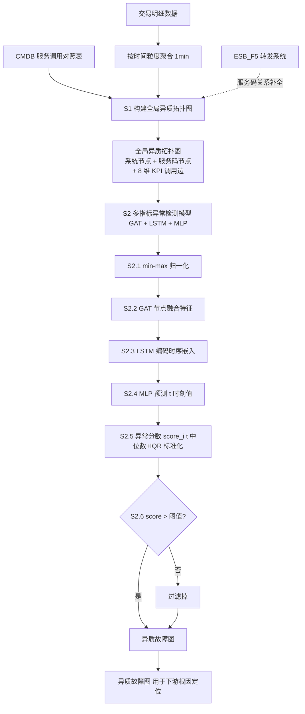
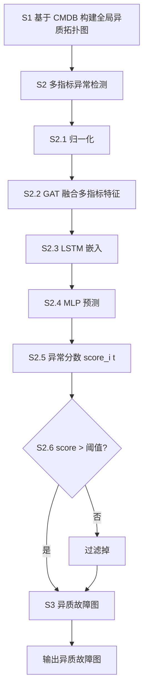

# 一种基于多指标的时间序列异常检测方法、系统及存储介质（CN113962273B）

> 申请人：北京必示科技有限公司  
> 申请日：2021-09-22  
> 公开/授权日：2022-03-18（申请公布日 2022-01-21，授权公告日 2022-03-18）  
> IPC分类号：G06F 11/34 (2006.01); G06K 9/62 (2022.01); G06N 3/08 (2006.01)  
> 发明人：沈梦家、曹立、隋楷心、刘大鹏、张文池  
> 关联文档：同目录下 CN113962273B.pdf

## 一、文档信息速览

| 字段 | 值 |
|---|---|
| 专利号 | CN113962273B |
| 类型 | 发明专利（B，已授权） |
| 申请号 | 202111102855.1 |
| 申请日 | 2021-09-22 |
| 公开号 | CN113962273A（公布日 2022-01-21） |
| 授权公告号 | CN113962273B（授权公告日 2022-03-18） |
| 申请人 | 北京必示科技有限公司 |
| 发明人 | 沈梦家、曹立、隋楷心、刘大鹏、张文池 |
| IPC | G06F 11/34; G06K 9/62; G06N 3/08 |
| 审查员 | 范玉霞 |
| 权利要求页数 | 3 页（共 9 项权利要求） |
| 说明书页数 | 7 页 |
| 附图页数 | 2 页（5 张图） |
| 法律状态 | 已授权（2022-03-18） |

## 二、背景（Background）

随着云计算、服务计算等技术的快速发展，越来越多企业将应用程序和系统服务部署在分布式云环境或微服务架构中。分布式架构虽具备更好的扩展性和更低的成本，但同时引入了复杂的调用关系——一次业务请求往往涉及多个系统、多个服务码的跨系统调用。

为保证系统正常运行，企业通常要针对分布式环境进行运维时间序列的异常检测。但**目前大部分异常检测算法仅针对单一指标进行异常检测及触发告警，未考虑多个关键性能指标间存在的复杂依赖关系**，因此现有的异常检测算法非常容易造成误报，**尤其在异质拓扑结构中较细粒度的调用边的指标异常检测场景中，误报率较高**。

**具体痛点**：

1. **异质调用关系难以表达**：当前大型企业多采用微服务架构 + 企业服务总线（ESB）架构设计，系统和服务间的复杂调用关系难以形式化表达，尤其在系统日志中缺少全局流水号时，无法直接通过日志推导上下游关系。
2. **ESB_F5 转发解耦系统和服务**：金融证券等企业一般使用 ESB_F5 做业务请求转发和负载均衡，因此监控系统日志中难以得到上下游服务码间直接的调用关系。
3. **单指标异常检测误报率高**：现有算法大多单指标检测，未融合多指标关联特征，误报严重。
4. **粗粒度系统级根因定位难**：仅基于系统级调用关系难以定位到细粒度的服务码级根因。

## 三、目的（Purpose / Problems Solved）

- **痛点 1 → 解决方案**：异质调用关系难以表达。**方案**：基于 CMDB 服务调用对照表，构建**全局异质拓扑图**（系统 + 服务码两种节点类型）。
- **痛点 2 → 解决方案**：单指标检测误报率高。**方案**：构建基于**多指标**的时间序列异常检测模型，通过**图注意力机制**融合多指标关联特征。
- **痛点 3 → 解决方案**：异质图中边级异常难定位。**方案**：以调用边为基本单位进行异常检测，每条边承载 8 维 KPI（交易量、成功量、响应量、失败量、未响应量、成功率、响应率、响应时间）。
- **痛点 4 → 解决方案**：异常检测结果难直接利用。**方案**：基于异常检测结果生成**异质故障图**，可直接用于后续根因定位等下游任务。
- **痛点 5 → 解决方案**：ESB_F5 转发关系缺失。**方案**：通过 CMDB 服务调用对照表补全 ESB_F5 转发的服务码关系。

## 四、核心原理（Principles）

### 4.1 系统总览

本发明是 CN113900844B 的"姊妹专利"——后者基于本发明的异常检测结果进一步做根因定位。本发明构建了"**全局异质拓扑图构建 → 多指标 GAT+LSTM+MLP 异常检测 → 异质故障图生成**"三步流水线：

1. **S1 全局异质拓扑图构建**：基于 CMDB 服务调用对照表，构建系统 + 服务码异质图。
2. **S2 多指标异常检测**：对每条调用边的 n 个 KPI 指标，用 GAT 融合多指标关联特征 → LSTM 编码时序 → MLP 预测 → 异常分数 → 阈值判定。
3. **S3 异质故障图生成**：从全局图中过滤掉正常调用边，仅保留异常边，作为下游根因定位输入。

### 4.2 关键概念定义

（与 CN113900844B 基本相同，此处简略）

- **全局异质拓扑图**：系统节点 S + 服务码节点 T。
- **调用边**：承载 8 维 KPI 时序。
- **多指标融合**：GAT 把多个 KPI 节点的关联权重学习出来。
- **异质故障图**：仅显示异常边的子图。
- **关联权重**：通过多个节点注意力值的指数函数的比确定。
- **中位数 + IQR 标准化**：使用中位数+四分位距而非均值+标准差，鲁棒性强。
- **ESB_F5 转发**：通过 CMDB 补全服务码调用关系。

### 4.3 数学原理

**1) GAT 节点融合特征 $h_i$**

$$
h_i = \sigma\Bigl(\sum_{j \in N(i)} \alpha_{ij} W \cdot v_j\Bigr)
$$

其中 $\sigma$ 为 sigmoid 激活，$v_j$ 为第 $j$ 个指标的 $w$ 维特征向量（$w$ 为时间窗口维度），$N(i)$ 为邻居节点集合。

**2) 关联权重 $\alpha_{ij}$（关键创新：基于"多个节点注意力值的指数函数的比"）**

$$
\alpha_{ij} = \frac{\exp(e_{ij})}{\sum_{l \in N(i)} \exp(e_{il})}
$$

其中 $e_{ij} = \text{LeakyReLU}\bigl(\mathbf{a}^\top [W v_i \Vert W v_j]\bigr)$，$\Vert$ 为特征连接，$W$ 为可学习参数矩阵，$\mathbf{a}$ 为注意力向量。

**3) LSTM 编码 + MLP 预测**

融合特征 $H_i$（$n \cdot w$ 维）与原始序列特征（$n \cdot w$ 维）连接成 $n \cdot 2w$ 维，输入 LSTM 编码长期时序依赖，再输入 MLP 得 t 时刻预测值 $\hat{x}_i(t)$。

**4) MSE 损失**

$$
\mathcal{L}_{MSE} = \frac{1}{n} \sum_{i=1}^{n} \bigl(x_i(t) - \hat{x}_i(t)\bigr)^2
$$

**5) 异常分数 $score_i(t)$（中位数 + IQR 标准化，鲁棒性强）**

$$
dev_i(t) = |x_i(t) - \hat{x}_i(t)|
$$

$$
score_i(t) = \frac{dev_i(t) - \text{median}(dev)}{\text{IQR}(dev)}
$$

**6) 调用边异常判定**

若 $score_i(t) > \tau$（预设阈值），则调用边为异常。

### 4.4 与 CN113900844B 的关系

| 维度 | CN113962273B（本专利） | CN113900844B（姊妹专利） |
|---|---|---|
| 任务 | 仅异常检测 | 异常检测 + 根因定位 |
| 拓扑 | 全局异质拓扑图 | 全局异质拓扑图 |
| 异常检测 | GAT + LSTM + MLP | 相同 |
| 输出 | 异质故障图 | 异质故障图 + Top-K 根因 |
| 根因算法 | 无 | PageRank + 异常传播因子 |
| 公开日 | 2022-01-21 | 2022-01-07（更早） |
| 授权日 | 2022-03-18 | 2024-07-09 |

**注**：CN113900844B 在申请日（2021-09-26）上略晚于本专利（2021-09-22），但本专利公开更早（2022-01-21 vs 2022-01-07 实际是 CN113900844B 略晚 2 周公开）。两者在算法上具有高度一致性（同一团队、同一时间窗的姊妹专利），CN113900844B 在本专利基础上扩展了根因定位模块。

## 五、算法详解（Algorithm）

### 5.1 输入 / 输出

- **输入**：CMDB 服务调用对照表 + 交易明细数据 + 时间粒度。
- **输出**：每条调用边是否异常的判定 + 异质故障图。

### 5.2 伪代码

```python
def multi_metric_anomaly_detection(cmdb, transactions, time_granularity='1min'):
    # S1: 构建全局异质拓扑图
    G = HeterogeneousGraph()
    for s in cmdb.systems:
        G.add_node(s, type='system')
    for t in cmdb.service_codes:
        G.add_node(t, type='service_code')
    for call in cmdb.call_relations:
        edge = transactions_to_timeseries(call, time_granularity)
        G.add_edge(call.upstream, call.downstream, kpis=edge)

    # S2: 多指标异常检测
    anomaly_model = GATLSTMMLP(in_dim=time_window, n_metrics=8)
    optimizer = Adam(lr=1e-3)
    for epoch in range(EPOCHS):
        for edge in G.edges:
            ts = edge.kpis  # (T, 8)
            ts_norm = minmax_scale(ts)  # S2.1
            H = anomaly_model.gat(ts_norm)  # S2.2 GAT 节点融合特征
            embed = anomaly_model.lstm(H, ts_norm)  # S2.3
            pred = anomaly_model.mlp(embed)  # S2.4
            loss = mse_loss(pred, ts_norm)  # MSE
            loss.backward(); optimizer.step()
    # 异常分数
    for edge in G.edges:
        pred = anomaly_model.predict(edge.kpis)
        dev = abs(edge.kpis - pred)
        score = (dev - median(dev)) / IQR(dev)  # S2.5
        edge.is_anomaly = (score > THRESHOLD)  # S2.6

    # S3: 异质故障图
    G_fault = G.subgraph(edges_where(is_anomaly=True))

    return G_fault
```

### 5.3 关键数学

- GAT 节点融合（公式 1）。
- 关联权重 softmax（公式 2）。
- MSE 损失。
- 中位数 + IQR 异常分数标准化（公式 5）。

### 5.4 复杂度分析

- 拓扑图构建：$O(V + E)$。
- min-max 归一化：$O(E \cdot T \cdot n)$。
- GAT：$O(E \cdot n^2 \cdot d)$。
- LSTM 训练：$O(E \cdot T \cdot d^2)$。
- 异常分数计算：$O(E \cdot n \cdot T)$。

### 5.5 示例

以金融证券业务监控为例：
1. 解析交易明细：调用方、接收方、服务码、是否响应、是否成功、响应时间等。
2. 构建异质拓扑图：系统 S1, S2, S3, S4 + 服务码 T1, T2。
3. 调用边 KPI：交易量 100, 成功量 95, 响应量 95, 失败量 5, 未响应量 0, 成功率 95%, 响应率 95%, 响应时间 50ms。
4. GAT 融合 8 维 KPI 关联特征：成功率-响应时间-失败量 强相关。
5. LSTM 编码时序：识别"今早 10 点开始响应时间从 50ms 上升至 200ms"的趋势。
6. MLP 预测：预测响应时间 60ms，实际 200ms → 偏离度大。
7. 异常分数标准化后 > 阈值 → 调用边异常。
8. 异质故障图保留异常边，运维一眼看到"S1→T1 调用边异常"。

## 六、系统架构图（Architecture）



## 七、流程图（Process Flow）



## 八、关键创新点（Key Innovations）

- **+ 异质拓扑图 + ESB_F5 关系补全**：基于 CMDB 构建系统+服务码异质图，通过 CMDB 服务调用对照表补全 ESB_F5 转发的服务码调用关系。
- **+ GAT 融合多指标关联特征**：通过图注意力机制学习 8 维 KPI 节点间的关联权重，比单指标检测误报率显著降低。
- **+ 关联权重的"指数函数的比"定义**：基于 softmax 形式的注意力值定义关联权重，可学习、可解释。
- **+ 中位数 + IQR 标准化异常分数**：相比传统均值+标准差，更能抵抗异常值干扰，鲁棒性强。
- **+ 异质故障图作为下游输入**：本专利的输出可直接作为根因定位（CN113900844B）等下游任务的输入，构成完整的 AIOps 故障诊断流水线。

## 九、权利要求摘要（Claims Summary）

- **独立权利要求 1（方法）**：S1 全局异质拓扑图 → S2 多指标异常检测 → S3 异质故障图。
- **独立权利要求 8（系统）**：全局异质拓扑图生成模块 + 异常检测模块 + 异质故障图生成模块。
- **独立权利要求 9（介质）**：存储介质。
- **从属权利要求 2**：调用边由交易明细 + 时间粒度聚合，KPI 至少包含交易量/成功量/响应量/失败量/未响应量/成功率/响应率/响应时间中的两种或多种组合。
- **从属权利要求 3**：基于多指标的时间序列异常检测模型通过图注意力机制构建。
- **从属权利要求 4**：GAT 节点融合特征 + 关联权重（指数函数比）的具体公式。
- **从属权利要求 5**：MLP 预测 + MSE 损失函数。
- **从属权利要求 6**：异常分数中位数 + IQR 标准化。
- **从属权利要求 7**：阈值判定异常。

## 十、应用场景（Use Cases）

- **金融证券业务监控**：交易码级异常检测 → 异质故障图 → 后续根因定位。
- **支付系统 KPI 异常**：成功率/响应率/失败量联合异常检测。
- **银行核心系统日终**：日终跑批任务的多指标异常检测。
- **保险核心业务系统**：投保成功率、响应时间、失败量联合监控。
- **微服务架构 K8s 应用**：多服务调用链异常检测。
- **分布式数据库调用链**：读写 QPS、延迟、错误率联合异常。

## 十一、相关专利（Related Patents in this set）

- **CN113448808B** 一种批处理任务中单任务时间的预测方法（与本发明都涉及"时序异常检测"，但本发明是"多指标异常"，该发明是"时长预测"）。
- **CN113568991B** 一种基于动态风险的告警处理方法（与本发明都涉及"故障处理"，但本发明是"异常检测"，该发明是"告警合并"）。
- **CN113722616A** 一种多维度时间序列数据的自动洞见发现方法（与本发明都基于"多指标"，但本发明是"异常"，该发明是"洞见"）。
- **CN113806495A** 一种离群机器检测方法和装置（与本发明都涉及"异常检测"，但本发明是"调用边异常"，该发明是"机器离群"）。
- **CN113900844B** 一种基于服务码级别的故障根因定位方法（**本发明的姊妹专利**——直接消费本发明的异质故障图，扩展为根因定位）。
- **CN114721861B** 一种基于日志差异化比对的故障定位方法（与本发明都涉及"故障定位"，但本发明基于"指标"，该发明基于"日志"）。

## 十二、术语表（Glossary）

- **异质拓扑图（Heterogeneous Topology Graph）**：节点/边类型不唯一的图。
- **GAT（Graph Attention Network）**：图注意力网络。
- **CMDB（Configuration Management Database）**：配置管理数据库。
- **ESB_F5**：企业服务总线 F5 转发。
- **服务码（Service Code）**：细粒度服务/接口标识符。
- **调用边（Call Edge）**：上游节点到下游节点的有向边。
- **KPI（Key Performance Indicator）**：关键性能指标。
- **LSTM（Long Short-Term Memory）**：长短期记忆网络。
- **MLP（Multi-Layer Perceptron）**：多层感知机。
- **MSE（Mean Square Error）**：均方误差。
- **IQR（Interquartile Range）**：四分位距 $Q_3 - Q_1$。
- **异质故障图（Heterogeneous Fault Graph）**：过滤正常边后的子图。
- **关联权重**：通过多个节点注意力值的指数函数的比确定。
- **中位数+IQR 标准化**：使用中位数和四分位距进行鲁棒标准化。

## 十三、参考与延伸阅读

- P. Veličković, G. Cucurull, A. Casanova, et al., "Graph Attention Networks", ICLR 2018（GAT 经典论文）。
- S. Hochreiter, J. Schmidhuber, "Long Short-Term Memory", Neural Computation 1997（LSTM 经典论文）。
- 异质信息网络（HIN, Heterogeneous Information Network）相关工作：Han et al., "Mining Heterogeneous Information Networks", 2012。
- **重要关联**：同批次必示专利 CN113900844B 是本发明的扩展版本——使用相同的 GAT + LSTM 思路但增加 PageRank 根因排序模块。
- 微服务调用链监控工具：Jaeger、Zipkin、SkyWalking、Pinpoint。
- 工业级多指标异常检测：阿里巴巴 ICASP、Datadog Watchdog、Netflix Atlas。
