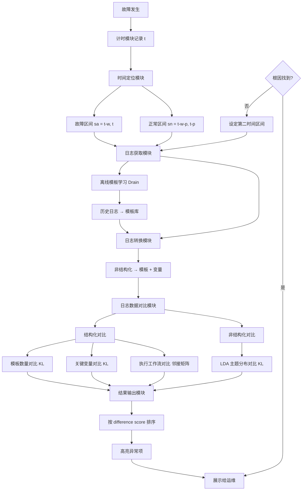
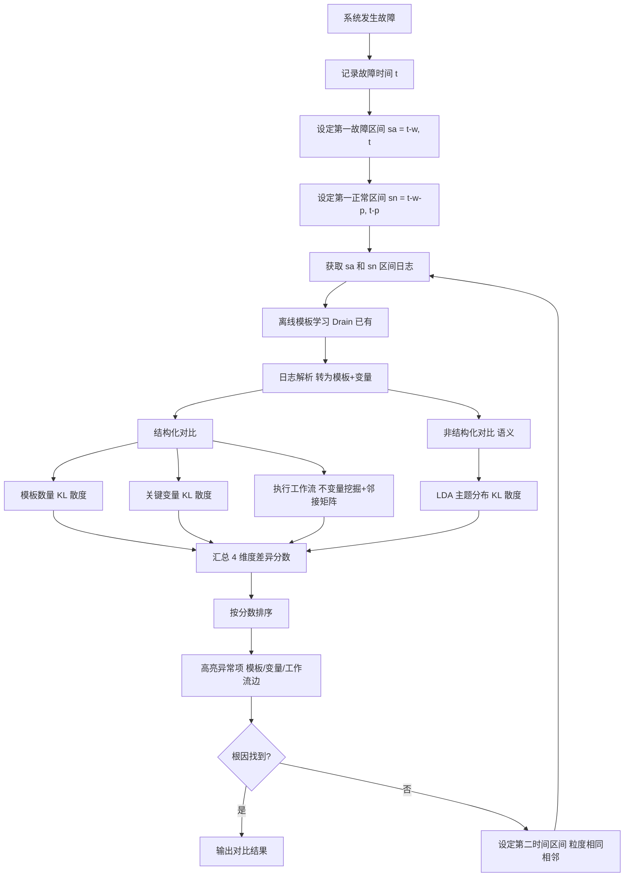

# 一种基于日志差异化比对的故障定位方法与系统（CN114721861B）

> 申请人：北京必示科技有限公司  
> 申请日：2022-05-23  
> 公开/授权日：2022-10-04（申请公布日 2022-07-08，授权公告日 2022-10-04）  
> IPC分类号：G06F 11/07 (2006.01)  
> 发明人：曹立、殷康璘、刘大鹏  
> 关联文档：同目录下 CN114721861B.pdf

## 一、文档信息速览

| 字段 | 值 |
|---|---|
| 专利号 | CN114721861B |
| 类型 | 发明专利（B，已授权） |
| 申请号 | 202210563123.0 |
| 申请日 | 2022-05-23 |
| 公开号 | CN114721861A（公布日 2022-07-08） |
| 授权公告号 | CN114721861B（授权公告日 2022-10-04） |
| 申请人 | 北京必示科技有限公司 |
| 发明人 | 曹立、殷康璘、刘大鹏 |
| IPC | G06F 11/07 |
| 审查员 | 王璐 |
| 权利要求页数 | 2 页（共 7 项权利要求） |
| 说明书页数 | 8 页 |
| 附图页数 | 3 页（3 张图） |
| 法律状态 | 已授权（2022-10-04） |

## 二、背景（Background）

由于大规模在线服务的复杂性，故障总是不可避免地会发生。服务故障会导致系统无法稳定运行，严重影响用户体验并带来经济损失。因此，**及时、准确的故障诊断，定位到故障的根因，从而解决问题、止损故障、恢复系统正常运行是至关重要的**。

**日志数据是软件系统中的一类重要数据源**，详细记录了系统的运行状态和用户行为。当故障发生时，工程师通常会检查故障发生前的相关日志数据，从日志中找到相关故障线索，从而定位到根因。但是由于软件服务的规模较大，**系统日志的规模也很庞大，通常每分钟有成千上万条日志产生**。想从海量的日志数据中找到故障线索，以往的方式主要有两种：

**方式 1：手工检查**
- 排障过程中，工程师通常采用手工检查的方法，比如通过 grep 搜索日志中的一些关键字（如 warning、error）。
- **但这种方法在实际中效果不够理想**：
  - 异常关键字难以枚举（无法提前知道"故障对应的关键字是什么"）；
  - 由于软件服务存在复杂的拓扑依赖关系，通常满足关键字的日志有很多，因此通过 grep 筛查之后的异常日志数量仍然很多，肉眼排查工作量很大。

**方式 2：日志异常检测（流式）**
- 学术界目前已有较多日志异常检测的工作，旨在实时检测在线日志的异常。
- **但流式异常检测开销很大**，面临实际中的海量日志，**流式异常检测会消耗大量的系统资源，伴随着经常发生的误报和漏报**，所以在实际中效果并不好。

**因此，本发明要解决的核心问题**：能否在故障发生**触发时**，对"故障时段 vs 正常时段"的日志做"差异化比对"，自动准确地找出与故障相关的日志表现，为根因定位提供线索。

## 三、目的（Purpose / Problems Solved）

- **痛点 1 → 解决方案**：手工 grep 关键字效率低、关键字难以枚举。**方案**：对比"故障时段"与"正常时段"日志，自动找出差异，不依赖关键字枚举。
- **痛点 2 → 解决方案**：流式异常检测开销大、误报漏报多。**方案**：改为**触发式**（故障发生时启动）离线对比，**避免 7×24 流式计算的资源消耗**。
- **痛点 3 → 解决方案**：日志非结构化难直接比较。**方案**：离线学习模板（Drain 算法），将非结构化日志转换为"模板 + 变量"的结构化表示。
- **痛点 4 → 解决方案**：单一维度对比难定位。**方案**：从**模板数量、关键变量分布、执行工作流、语义主题** 4 维度全面对比。
- **痛点 5 → 解决方案**：根因定位困难。**方案**：用 KL 散度量化"差异分数"并排序，高亮差异最大的维度，直接给运维线索。

## 四、核心原理（Principles）

### 4.1 系统总览

本发明构建了一个"**故障触发 → 时间区间定位 → 离线模板学习 → 4 维度差异化比对 → 输出对比结果**"的日志根因定位流水线：

1. **故障触发**：系统发生故障时，记录故障发生当前时间 $t$。
2. **时间区间定位**：设定第一故障发生时间区间 $s_a = [t-w, t]$（窗口长度 $w$，典型 1 小时）和第一正常时间区间 $s_n = [t-w-p, t-p]$（周期 $p$，典型 24 小时）。
3. **离线模板学习**：用 Drain 算法从历史日志中学习模板。
4. **4 维度差异化比对**：
   - **结构化日志对比**：
     - 模板数量对比：直方图 + 高亮数量异常模板
     - 关键变量对比：用 KL 散度衡量分布差异
     - 执行工作流对比：用不变量挖掘算法对比工作流图
   - **非结构化日志对比（语义对比）**：
     - 基于 LDA 主题模型，提取故障/正常时段的主题分布并对比
5. **输出对比结果**：按 difference score 排序展示。

### 4.2 关键概念定义

- **离线模板学习（Offline Template Learning）**：使用 Drain 算法从历史日志中离线学习模板，把非结构化日志转为"模板 + 变量"。
- **模板（Template）**：日志的固定部分，如"User {} login from {} at {}"。
- **变量（Variable）**：日志中动态变化的部分，如 user_id、IP、时间戳。
- **Drain 算法**：基于树结构的日志模板提取算法，业界表现最优。
- **第一故障发生时间区间 $s_a = [t-w, t]$**：故障触发时刻 $t$ 之前的 $w$ 长度窗口。
- **第一正常时间区间 $s_n = [t-w-p, t-p]$**：比故障区间早一个周期 $p$ 的同等长度窗口。
- **结构化日志对比**：基于模板 + 变量的对比。
- **非结构化日志对比（语义对比）**：基于 LDA 主题模型的对比。
- **执行工作流**：从日志中挖掘出的任务执行顺序图（基于不变量挖掘）。
- **不变量挖掘（Invariant Mining）**：从日志中挖掘"模板数量关系"（如 n(A) = n(B) + n(C)）以构建工作流图。
- **KL 散度（Kullback-Leibler Divergence）**：衡量两个概率分布的差异。
- **LDA（Latent Dirichlet Allocation）**：主题模型，用于从文档集合中发现抽象主题。
- **Difference Score**：本发明中 4 维度差异的统一量化指标。
- **第二故障发生时间区间**：若在第一故障发生时间区间内未找到根因，则向相邻区间扩展。

### 4.3 数学原理

**1) 时间区间定义**

$$
s_a = [t - w, t], \quad s_n = [t - w - p, t - p], \quad p > w
$$

典型 $p = 24$ 小时，$w = 1$ 小时。

**2) 模板数量差异（KL 散度）**

将窗口内 $x$ 种模板视为离散分布 $p(x_i) = n(x_i) / n$，则模板差异分数：

$$
\text{Score}_{template} = D_{KL}(p_a \parallel p_n) = \sum_i p_a(x_i) \log \frac{p_a(x_i)}{p_n(x_i)}
$$

**3) 关键变量分布差异（KL 散度）**

$$
\text{Score}_{variable} = D_{KL}(\text{dist}_a \parallel \text{dist}_n)
$$

对于差异较大的高亮提示。

**4) 工作流图差异（邻接矩阵欧式距离）**

$$
\text{Score}_{workflow} = \|A_a - A_n\|_F = \sqrt{\sum_{i,j} (A_a[i,j] - A_n[i,j])^2}
$$

其中 $A_a$ 和 $A_n$ 分别为故障和正常时段工作流的邻接矩阵。

**5) LDA 主题分布距离（KL 散度）**

$$
\text{Score}_{semantic} = D_{KL}(P_a \parallel P_n)
$$

其中 $P_a, P_n \in \mathbb{R}^K$ 分别为两个窗口属于 $K$ 个主题的概率分布。

**6) 主题模型矩阵分解（LDA 核心思想）**

$$
\text{doc-word matrix} \approx \text{doc-topic matrix} \times \text{topic-word matrix}
$$

**7) 不变量挖掘工作流**

例如 $n(T_1) + n(T_2) = n(T_3) = n(T_4) = n(T_5) + n(T_6)$，推测工作流为 $T_1 \to T_3 \to T_4 \to \{T_5 \text{ 或 } T_6\}$，分支结构 $T_2 \to T_3$。

### 4.4 与现有技术的差异

| 维度 | 现有技术 | 本发明 |
|---|---|---|
| 触发方式 | 7×24 流式异常检测 | 故障触发式 |
| 对比对象 | 实时单条日志 | 故障 vs 正常窗口日志 |
| 模板学习 | 在线/无 | 离线 Drain |
| 对比维度 | 单一 | 4 维度（模板/变量/工作流/语义） |
| 差异量化 | 关键字计数 | KL 散度 + 邻接矩阵距离 |
| 资源开销 | 大（流式） | 小（触发式离线） |

## 五、算法详解（Algorithm）

### 5.1 输入 / 输出

- **输入**：系统故障触发时间 $t$、历史日志（用于离线模板学习）、配置参数 $p, w$。
- **输出**：4 维度差异分数排序结果 + 高亮异常项 + 第二时间区间（若需要）。

### 5.2 伪代码

```python
def log_diff_compare_fault_localization(t, p=24, w=1):
    # 1) 离线模板学习（Drain 算法）
    templates = drain_learn(historical_logs)  # 在故障发生前离线完成

    # 2) 时间区间定位
    sa = [t - w, t]  # 故障区间
    sn = [t - w - p, t - p]  # 正常区间

    # 3) 获取日志
    logs_a = fetch_logs(sa)
    logs_n = fetch_logs(sn)

    # 4) 结构化：将非结构化日志转为模板 + 变量
    parsed_a = parse_with_templates(logs_a, templates)  # [(template, [vars])]
    parsed_n = parse_with_templates(logs_n, templates)

    # 5) 结构化对比
    # (a) 模板数量对比
    hist_a = template_histogram(parsed_a)
    hist_n = template_histogram(parsed_n)
    score_template = kl_divergence(hist_a, hist_n)
    highlight_new_or_diff_templates(hist_a, hist_n)

    # (b) 关键变量对比（KL 散度）
    var_dist_a = variable_distribution(parsed_a, templates.var_indices)
    var_dist_n = variable_distribution(parsed_n, templates.var_indices)
    score_variable = kl_divergence(var_dist_a, var_dist_n)
    highlight_diff_variables(var_dist_a, var_dist_n)

    # (c) 执行工作流对比（不变量挖掘）
    workflow_a = mine_workflow(parsed_a)  # 不变量挖掘
    workflow_n = mine_workflow(parsed_n)
    A_a = adj_matrix(workflow_a)
    A_n = adj_matrix(workflow_n)
    score_workflow = frobenius_distance(A_a, A_n)
    diff_edges = (A_a - A_n).nonzero()  # 找出丢失/新增的边
    highlight_workflow_anomalies(diff_edges)

    # 6) 非结构化对比（语义对比）
    # LDA 主题模型：窗口 → 主题分布
    lda = LDA(K=4)  # K 主题
    lda.fit(historical_logs)  # 离线训练
    P_a = lda.topic_distribution(logs_a)  # (K,) 向量
    P_n = lda.topic_distribution(logs_n)
    score_semantic = kl_divergence(P_a, P_n)

    # 7) 输出对比结果
    scores = {
        'template': score_template,
        'variable': score_variable,
        'workflow': score_workflow,
        'semantic': score_semantic
    }
    sorted_scores = sorted(scores.items(), key=lambda x: -x[1])
    output(sorted_scores, high_lights={
        'template': diff_templates,
        'variable': diff_vars,
        'workflow': diff_edges
    })

    # 8) 若未找到根因，扩展第二时间区间
    if not root_cause_found(scores):
        sa2 = [sa[0] - w, sa[0]]  # 相邻粒度相同区间
        logs_a2 = fetch_logs(sa2)
        # 重复步骤 5-7
        ...

    return output
```

### 5.3 关键数学

- 时间区间定义（公式 1）。
- 模板数量 KL 散度（公式 2）。
- 关键变量 KL 散度（公式 3）。
- 工作流图邻接矩阵距离（公式 4）。
- LDA 主题分布距离（公式 5）。
- LDA 矩阵分解（公式 6）。
- 不变量挖掘工作流（公式 7）。

### 5.4 复杂度分析

- Drain 模板学习：$O(N \log N)$，$N$ 日志条数。
- 日志解析：$O(N)$。
- 模板直方图：$O(N)$。
- 关键变量分布：$O(N)$。
- LDA 主题提取：$O(K \cdot N)$，$K$ 主题数。
- 不变量挖掘：$O(M^2)$，$M$ 模板数。
- 邻接矩阵距离：$O(M^2)$。

### 5.5 示例

以"Java 应用 OOM（Out of Memory）"为例：
1. 故障触发时间 $t$ = 10:00，$p=24h$，$w=1h$。
2. 故障区间 $s_a = [09:00, 10:00]$，正常区间 $s_n = [09:00 \text{ of yesterday}, 10:00 \text{ of yesterday}]$。
3. Drain 学习得到 50 个模板，如"GC pause {} ms"、"Allocated {} bytes"、"Request {} failed with {}"等。
4. 模板数量对比：故障区间出现新模板 "OOM killed" 3 次（正常区间无）→ 高亮新模板。
5. 关键变量对比：GC 暂停时间分布差异极大 → KL 散度高 → 高亮。
6. 工作流对比：正常区间工作流是 "Request → Process → Response"；故障区间缺失 "Response" 边 → 高亮。
7. 语义对比：LDA 主题分布显示故障区间 "memory" "GC" "killed" 等主题概率上升 → KL 散度高。
8. 排序结果：workflow > variable > template > semantic。
9. 运维根据高亮快速定位 OOM 根因。

## 六、系统架构图（Architecture）



## 七、流程图（Process Flow）



## 八、关键创新点（Key Innovations）

- **+ 故障触发式 vs 流式**：只在故障发生时启动离线对比，避免 7×24 流式异常检测的系统资源消耗。
- **+ 4 维度全面对比**：模板数量、关键变量分布、执行工作流、语义主题，从结构化 + 非结构化两个角度全面刻画"异常表现"。
- **+ Drain 离线模板学习**：业界最优的日志模板提取算法，且模板学习离线完成、模板匹配时间复杂度可忽略，对故障定位时效性影响极小。
- **+ 不变量挖掘工作流**：通过模板数量关系（如 n(T1) + n(T2) = n(T3)）自动挖掘任务执行顺序图，弥补传统工作流监控的不足。
- **+ 多维度 KL 散度统一量化**：所有维度的差异都用 KL 散度（或邻接矩阵距离）量化，统一可比，按分数排序展示。
- **+ 二级时间区间扩展**：若在第一故障区间未找到根因，自动向相邻区间扩展，避免漏检。

## 九、权利要求摘要（Claims Summary）

- **独立权利要求 1（方法）**：故障触发 → 时间区间定位（$s_a, s_n$）→ 离线模板学习 + 日志转换 → 结构化 + 非结构化对比 → 输出对比结果。
- **独立权利要求 7（系统）**：包括计时模块、时间定位模块、日志获取模块、日志数据对比模块、结果输出模块。
- **从属权利要求 2**：典型参数 $p = 24$ 小时，$w = 1$ 小时。
- **从属权利要求 3**：非结构化日志数据对比为语义对比。
- **从属权利要求 4**：基于 LDA 主题模型进行日志的语义对比。
- **从属权利要求 5**：输出对比结果包括基于 KL 散度计算并按顺序示出。
- **从属权利要求 6**：第二故障发生时间区间机制（若第一区间未找到根因）。

## 十、应用场景（Use Cases）

- **Java 应用 OOM 故障定位**：通过 GC 暂停时间分布、工作流中断、模板数量异常等线索快速定位 OOM 根因。
- **数据库慢查询定位**：通过 SQL 模板数量、响应时间分布、工作流异常定位慢查询根因。
- **微服务调用链失败定位**：通过工作流图对比（任务执行中断）、模板异常定位失败服务。
- **Kubernetes Pod 异常重启定位**：通过工作流中断、关键变量（CPU/内存）分布异常定位。
- **网络设备故障**：通过日志模板数量变化、关键变量（如丢包率）分布异常定位。
- **电商大促订单失败**：通过订单处理工作流对比、模板数量异常定位根因服务。
- **金融支付系统异常**：通过工作流中断 + 关键变量（响应时间）异常定位支付链路根因。

## 十一、相关专利（Related Patents in this set）

- **CN113448808B** 一种批处理任务中单任务时间的预测方法（与本发明都涉及"故障诊断"，但本发明基于"日志"，该发明基于"时长预测"）。
- **CN113568991B** 一种基于动态风险的告警处理方法（与本发明都涉及"告警处理"，但本发明基于"日志对比"，该发明基于"告警拓扑"）。
- **CN113722616A** 一种多维度时间序列数据的自动洞见发现方法（与本发明都使用"主题模型"——本发明使用 LDA 做语义对比，该发明不涉及 LDA）。
- **CN113806495A** 一种离群机器检测方法和装置（与本发明都涉及"故障诊断"，但本发明基于"日志"，该发明基于"指标"）。
- **CN113900844B** 一种基于服务码级别的故障根因定位方法（与本发明都涉及"根因定位"，但本发明基于"日志模板"，该发明基于"调用图"）。
- **CN113962273B** 一种基于多指标的时间序列异常检测方法（与本发明都涉及"故障诊断"，但本发明基于"日志"，该发明基于"指标"）。

## 十二、术语表（Glossary）

- **Drain 算法**：基于树结构的日志模板提取算法，业界表现最优。
- **离线模板学习（Offline Template Learning）**：故障发生前离线完成模板提取。
- **故障区间 $s_a$**：故障触发前 $w$ 长度的窗口。
- **正常区间 $s_n$**：比故障区间早一个周期 $p$ 的同等长度窗口。
- **结构化日志对比**：基于模板 + 变量的对比。
- **非结构化日志对比（语义对比）**：基于 LDA 主题模型的对比。
- **模板数量对比**：故障 vs 正常区间模板出现频率对比。
- **关键变量对比**：故障 vs 正常区间变量值分布对比。
- **执行工作流对比**：故障 vs 正常区间任务执行顺序图对比。
- **不变量挖掘（Invariant Mining）**：通过模板数量关系构建工作流图。
- **KL 散度（Kullback-Leibler Divergence）**：衡量两个概率分布的差异。
- **LDA（Latent Dirichlet Allocation）**：主题模型。
- **Difference Score**：4 维度差异的统一量化指标。
- **邻接矩阵（Adjacency Matrix）**：图的矩阵表示。
- **第二时间区间**：若第一区间未找到根因，向相邻区间扩展。
- **Difference Score 排序**：按差异分数从大到小排序展示。

## 十三、参考与延伸阅读

- D. M. Blei, A. Y. Ng, M. I. Jordan, "Latent Dirichlet Allocation", JMLR 2003（LDA 主题模型经典论文）。
- P. He, J. Zhu, Z. Zheng, M. R. Lyu, "Drain: An Online Log Parsing Approach with Fixed Depth Tree", ICWS 2017（Drain 算法经典论文）。
- J. Lou, Q. Fu, S. Yang, Y. Xu, J. Li, "Mining Invariants from Console Logs for System Problem Detection", USENIX ATC 2010（不变量挖掘工作流经典论文）。
- 同批次必示专利 CN113722616A 也使用 LDA，但用于多维时序洞见发现；本发明用于日志语义对比。
- 工业级日志分析工具：Elastic Stack（ELK）、Splunk、Grafana Loki。
- 故障定位领域：因果分析、根因推荐、可解释 AI（XAI）。
- 微软 Azure、阿里云 SLS 的日志异常检测功能均参考类似"故障时段 vs 正常时段"对比思路。
