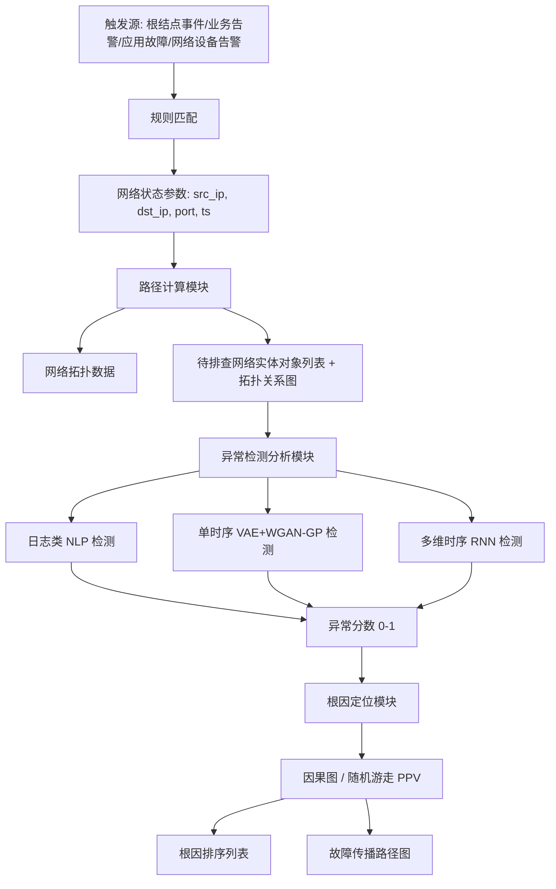
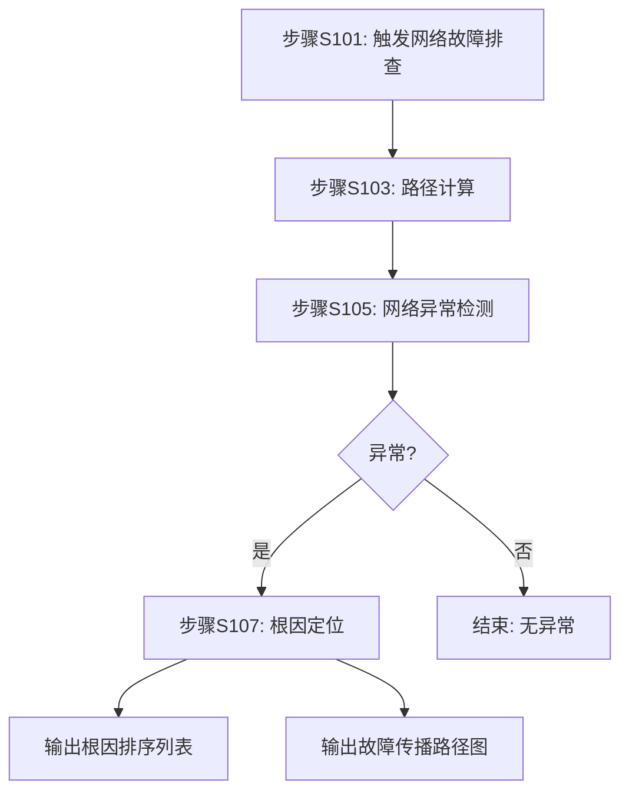

# 一种网络故障排查方法与系统（CN114785666B）

> 申请人：北京必示科技有限公司
> 申请日：2022-06-22
> 公开/授权日：2022-10-04
> IPC分类号：H04L 41/0631 (2022.01); H04L 41/0677 (2022.01); H04L 41/069 (2022.01); H04L 41/16 (2022.01)
> 发明人：汤汝鸣、曹立、聂晓辉、刘大鹏
> 关联文档：[同目录 CN114785666B.pdf](../../../CN114785666B.pdf)

## 一、文档信息速览

| 字段 | 值 |
|---|---|
| 专利号 | CN114785666B |
| 类型 | 授权发明专利（B） |
| 申请号 | 202210709991.5 |
| 申请日 | 2022-06-22 |
| 公开号 | CN114785666A |
| 公开/授权日 | 2022-10-04（授权公告日） |
| 申请人 | 北京必示科技有限公司 |
| 发明人 | 汤汝鸣、曹立、聂晓辉、刘大鹏 |
| IPC | H04L 41/0631; H04L 41/0677; H04L 41/069; H04L 41/16 |
| 法律状态 | 已授权 |

## 二、背景（Background）

本发明属于计算机技术领域，具体涉及一种网络故障排查方法与系统。其着眼点是 AIOps（智能运维）在网络运维中的落地——当企业业务应用出现响应时延上升、响应率下降等故障征兆时，如何在多设备、多链路、多拓扑的网络环境中快速自动化地定位到根因设备。

在传统网络运维中，企业内部的核心交换机、路由器、防火墙、应用服务器等网络设备均会接入网络监控平台，采集 CPU、内存、端口流量、丢错包等指标。当应用层告警触发后，应用运维工程师会先排查应用侧；若怀疑是网络问题，则需要将工单转交给网络运维工程师，由其基于经验人工排查各个网络设备，逐一比对各节点指标。整个过程高度依赖人，跨多个团队协同，且排查流程缺乏标准化、模块化能力。

在大型数据中心、云平台、SDN、混合云等复杂网络环境中：
- 网络设备种类多，指标体系复杂，无统一排查手段；
- 网络拓扑结构复杂，故障传播路径难以追溯；
- 涉及多个运维小组协作，沟通成本高；
- 严重依赖运维人员的领域知识，难以在不同网络环境间复用。

本发明由此提出"模块化、自动化、可疑路径驱动"的统一网络故障排查框架，将整个流程标准化为"触发 → 路径计算 → 异常检测 → 根因定位"四步。

## 三、目的（Purpose / Problems Solved）

- **痛点 → 方案：缺乏统一排查框架**：现有流程高度依赖人工经验，难以跨网络环境复用。本方案将排查流程抽象为四个标准化模块，便于在不同网络环境快速部署。
- **痛点 → 方案：故障根因难以定位**：网络设备数量多、拓扑复杂，人工逐设备排查工作量大。本方案通过"路径计算 + 异常检测 + 因果推断/随机游走"实现根因排序自动化。
- **痛点 → 方案：多源异构指标难以处理**：时序指标、日志、布尔/字符串类指标数据类型差异大。本方案对不同时序类型（日志类、多维时序类）使用不同的异常检测算法（NLP、LSTM、VAE-GAN、孤立森林）。
- **痛点 → 方案：可解释性差**：黑盒算法难以让运维人员理解根因。本方案基于检测结果、拓扑关系输出根因排序列表与故障传播路径图。
- **痛点 → 方案：传统 WGAN/VAE 阈值僵硬**：异常检测阈值难以适应波动变化。本方案使用 Peaks Over Threshold（POT）配合帕累托分布动态设定阈值。

## 四、核心原理（Principles）

### 系统总览

整个方案被划分为四个解耦的模块：
1. **触发模块**：根据预置规则（根结点事件、业务告警、应用故障、网络设备告警）触发网络故障排查，并输出源/目的 IP、端口号、时间戳等网络状态参数。
2. **路径计算模块**：基于拓扑信息和配置信息，由源-目的 IP 反向求出端到端路径，得到"待排查网络实体对象列表"及其拓扑关系图。
3. **异常检测分析模块**：针对列表中的网络实体（设备/链路），对每个指标执行相应的异常检测算法，输出异常分数（归一化到 0-1）。
4. **根因定位模块**：综合异常检测结果与拓扑关系，使用规则/机器学习算法输出根因排序列表与故障传播路径图。

### 关键概念

- **网络实体对象**：路由器、交换机、应用服务器、链路等可被监控的网络要素。
- **可疑路径信息**：在故障窗口内、由源到目的所经过的网络设备/链路的有序集合。
- **多维时序数据**：多个具有相关性或相似性指标的并行时间序列（如主备设备端口流量、CPU/内存使用率）。
- **变分自编码器（VAE）+ WGAN-GP**：用于单一时序数据的异常检测。
- **Peaks Over Threshold (POT)**：极值理论中的异常阈值设定方法，使用帕累托分布拟合超出初始阈值的数据。

### 数学原理

#### 4.1 历史波动幅度（用于本系列孪生网络专利；此专利也涉及）
设指标时间序列为 $X$，周期为 $T$，则历史波动幅度 $N$：

$$
N = \frac{1}{T} \cdot \sum_{i=1}^{T} \operatorname{std}\!\left(X^{(i)}\right)
$$

#### 4.2 单一时序异常分值

通过 VAE + WGAN-GP 学习重构窗口 $G(z)$，异常分值定义为真实分布 $P_{data}$ 与近似后验 $P_z$ 在采样 $L$ 次下的对数似然差：

$$
\operatorname{Score}(x) = \frac{1}{L}\sum_{l=1}^{L}\log P_{data}(x) - \log P_z(z_l)
$$

#### 4.3 POT 阈值

$$
t^* = t - \frac{\gamma}{\beta}
$$

其中 $t$ 为阈值初始化值，$\gamma$、$\beta$ 为帕累托分布的形状与比例参数，通过极大似然估计得出。最终阈值为：

$$
T_{final} = t^* - \frac{q \cdot N}{N_t}
$$

其中 $q$ 为小于 $t$ 的期望概率，$N$ 为序列长度，$N_t$ 为小于 $t$ 的样本数。

#### 4.4 根因排序（个性化页面排名）

$$
\pi = \alpha \cdot Q \cdot \pi + \frac{(1-\alpha)}{n} \cdot \mathbf{1}
$$

其中 $Q$ 为邻接矩阵 $A$ 归一化后的转移概率矩阵，$\alpha$ 为阻尼参数（典型值 0.85），$\mathbf{1}$ 为全 1 向量，$n$ 为节点数。该迭代最终输出每个节点的 PPV 分数，作为根因排序依据。

### 与现有技术的差异

| 维度 | 传统方案 | 本方案 |
|---|---|---|
| 触发方式 | 人工触发 | 规则自动触发（4 类触发源） |
| 路径计算 | 不存在或脚本化 | 标准化模块，输入 IP 自动反查路径 |
| 异常检测 | 单一算法 | 按数据类型分派（日志/单时序/多维时序） |
| 根因定位 | 经验人工 | 因果挖掘/PPV 随机游走 |
| 阈值设置 | 静态阈值 | POT + 帕累托 + 自适应分位数 |
| 可解释性 | 弱 | 输出根因排序 + 故障传播路径图 |

## 五、算法详解（Algorithm）

### 输入 / 输出

- **输入**：告警事件（根结点事件 / 业务告警 / 应用故障 / 网络设备告警），源/目的 IP、端口、时间戳；时序数据库中的历史指标、日志。
- **输出**：根因排序列表（设备+指标），故障传播路径图，异常检测结果。

### 伪代码

```python
# Step 1: 触发
def trigger(alert):
    rule_match = match_rule(alert)
    if rule_match is None:
        return None
    params = extract_network_params(alert)  # src_ip, dst_ip, port, ts
    return params

# Step 2: 路径计算
def path_compute(params, topology):
    src, dst = params.src_ip, params.dst_ip
    path = topology.shortest_path(src, dst)
    # path 包含候选设备/链路
    return {
        "entities": path.devices + path.links,
        "graph": path.to_digraph()
    }

# Step 3: 异常检测
def detect(entities, knowledge_base):
    results = []
    for ent in entities:
        # 指标类型: 多维时序 / 日志
        if ent.indicator_type == "log":
            score = nlp_log_anomaly(ent, kb=knowledge_base)
        elif ent.indicator_type == "single_ts":
            score = vaegan_anomaly(ent)  # 单时序
        elif ent.indicator_type == "multi_ts":
            score = rnn_anomaly(ent)  # 多维随机循环神经网络
        results.append({"entity": ent, "score": score})
    return normalize(results, [0, 1])

# Step 4: 根因定位
def localize(anomaly_results, graph):
    # 因果挖掘 / 随机游走 PPV
    G = build_causal_graph(anomaly_results, graph)
    ppv = personalized_page_rank(G, alpha=0.85)
    return sorted(ppv, key=lambda x: -x.score)
```

### 关键数学

异常检测三类的核心公式：
1. **日志**：使用 word2vec + LSTM 重构概率 + 模板相似度 → 异常分值加权平均。
2. **单时序**：VAE + WGAN-GP 重构误差 → 异常分值 → POT 阈值。
3. **多维时序**：随机循环神经网络 → 异常分值。

根因定位 PPV 公式见 §4.4。

### 复杂度分析

- 路径计算：基于图的最短路径，$O(V+E)$。
- 异常检测：单时序 VAE + WGAN-GP，每条序列 $O(L)$，多维时序 $O(d \cdot L)$（$d$ 为维度）。
- 根因定位（随机游走）：$O(k(V+E))$，$k$ 为迭代次数。
- 整体开销：随设备数线性增长，适用于大型网络。

### 示例

某金融支付系统出现"支付响应延迟上升"告警：
1. 触发：业务告警触发，输出 src_ip=10.0.1.5（支付网关），dst_ip=10.0.3.20（清结算），端口 8080，时间戳 t=2022-06-22 12:00:00。
2. 路径计算：反向求得路径 [支付网关 → 核心交换机A → 防火墙 → 核心交换机B → 清结算]。
3. 异常检测：
   - 核心交换机A CPU 使用率（多维时序）→ 随机循环神经网络分数 0.87；
   - 防火墙端口丢包率（多维时序）→ 分数 0.91；
   - 各设备日志 → NLP 方法未发现异常关键字。
4. 根因定位：PPV 给出排序：防火墙端口丢包率(0.91) > 核心交换机A CPU(0.87) > 核心交换机B CPU(0.42)。运维人员根据路径图确认是防火墙端口拥塞。

## 六、系统架构图（Architecture）



## 七、流程图（Process Flow）



## 八、关键创新点（Key Innovations）

- **+ 模块化排查框架**：将整个网络故障排查流程标准化为"触发 → 路径计算 → 异常检测 → 根因定位"四个独立模块，可独立替换与升级，提升通用性与部署效率。
- **+ 数据类型驱动的异常检测分派**：根据"日志类/单时序/多维时序"分别派发 NLP、VAE+WGAN-GP、随机循环神经网络，避免单一算法的局限。
- **+ VAE + WGAN-GP 联合异常检测**：通过 WGAN-GP 中的梯度惩罚项改善训练稳定性，结合马尔可夫链蒙特卡罗（MCMC）插值预估重建窗口，提升单时序异常检测精度。
- **+ POT + 帕累托自适应阈值**：使用极值理论的 Peaks Over Threshold 配合帕累托分布进行异常阈值设定，替代静态阈值，适配指标波动性。
- **+ 因果图 + 随机游走 PPV 根因排序**：以异常结果为节点、因果关系为边构建有向图，通过个性化页面排名向量（PPV）输出根因排序与故障传播路径图，可解释性强。

## 九、权利要求摘要（Claims Summary）

- **独立权利要求 1（方法）**：
  1. 设置网络故障排查触发规则；
  2. 基于触发规则实时监测网络状态；
  3. 检测到故障事件后上报网络状态参数；
  4. 基于网络状态参数计算可疑路径信息，输出待排查网络设备集合 + 拓扑关系；
  5. 对网络实体对象的指标进行异常检测分析（日志用 NLP、多维时序用随机循环神经网络）；
  6. 对异常检测结果进行根因定位，输出根因综合排序。

- **独立权利要求 8（系统）**：对应权利要求 1 方法的六个模块——规则设置模块、监测模块、上报模块、路径计算模块、异常检测分析模块、根因定位模块。

- **从属权利要求 2-7**：
  - 网络故障事件类型（根结点事件/业务告警/应用故障/网络设备告警）；
  - 网络状态参数（源/目的 IP、端口号、时间戳、配置信息）；
  - 指标范围定义（指标名称、指标类型、数据类型、采集粒度）；
  - 指标类型（多维时序类、日志类）；
  - 数据类型（浮点、布尔、字符串）；
  - NLP / RNN 算法选择。

## 十、应用场景（Use Cases）

- **金融支付系统监控**：当用户支付出现响应延迟时，自动反向排查"支付网关 → 交换机 → 防火墙 → 清结算"路径中的故障设备。
- **大型数据中心网络**：在多租户、SDN 环境下，对突发网络拥塞、设备宕机进行秒级自动根因定位。
- **云原生微服务通信**：跨多个 Kubernetes 集群的服务间网络故障排查，结合 Pod 拓扑进行根因定位。
- **CDN 与边缘节点异常**：对边缘节点链路抖动进行批量异常检测，输出丢包根因节点排序。
- **运营商骨干网运维**：对 BGP/MPLS 网络故障进行自动化根因分析，缩短 MTTR（平均修复时间）。

## 十一、相关专利（Related Patents in this set）

- CN114818643A（保留特定业务信息的日志模板提取方法）
- CN115062144B（基于知识库和集成学习的日志异常检测方法与系统）
- CN115391160B（异常变更检测方法、装置、设备及存储介质）
- CN115392403A（异常变更检测方法、装置、设备及存储介质）
- CN116302762A（基于红蓝对抗的故障定位应用的评测方法与系统）
- CN116820826A（基于调用链的根因定位方法、装置、设备及存储介质）

## 十二、术语表（Glossary）

- **VAE**：变分自编码器（Variational Autoencoder），生成式概率模型。
- **WGAN-GP**：带梯度惩罚的 Wasserstein 生成对抗网络。
- **LSTM**：长短期记忆网络（Long Short-Term Memory）。
- **PPV**：个性化页面排名向量（Personalized PageRank Vector），用于有向图节点重要性评估。
- **NLP**：自然语言处理（Natural Language Processing）。
- **POT**：Peaks Over Threshold，极值理论中的阈值设定方法。
- **CMDB**：Configuration Management Database，配置管理数据库。
- **KPI**：关键绩效指标（Key Performance Indicator）。
- **孪生网络**：Siamese Network，两个共享权重的子网络，用于度量输入对相似度。
- **Wasserstein 距离**：衡量两个概率分布之间距离的度量。

## 十三、参考与延伸阅读

- Chopra, S., et al. "Peaks Over Threshold for Anomaly Detection in Time Series."
- Bromberg, Y., et al. "Variational Autoencoder for Time Series Anomaly Detection."
- Page, L., et al. "The PageRank Citation Ranking: Bringing Order to the Web."
- 必示科技：必示 AIOps 异常检测与根因分析产品白皮书。
- 相关论文：PCA、孤立森林（Isolation Forest）、随机循环神经网络（Random Recurrent Neural Network）在多维时序异常检测中的应用。