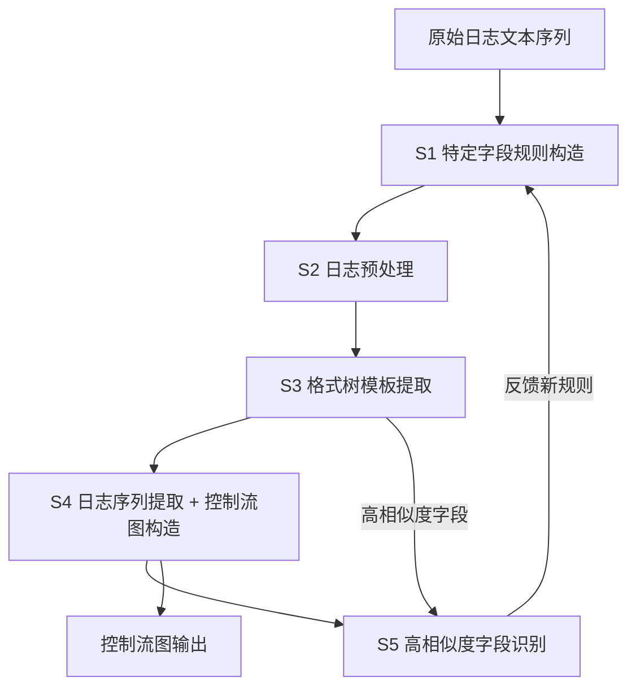
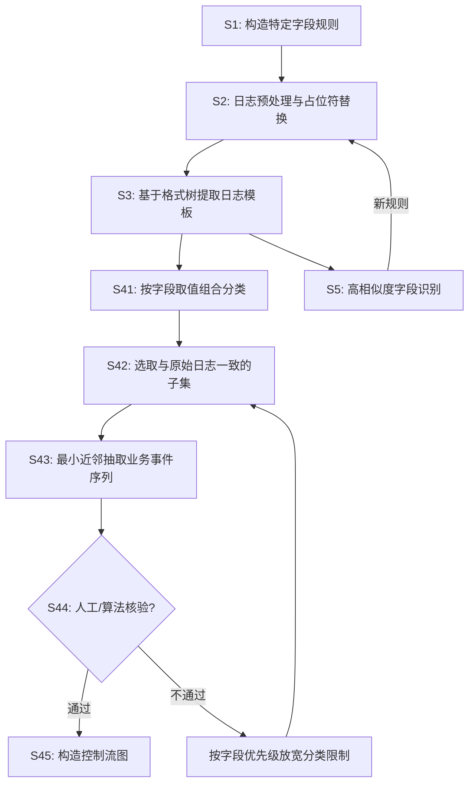

# 一种保留特定业务信息的日志模板提取方法（CN114818643A）

> 申请人：北京必示科技有限公司
> 申请日：2022-06-21
> 公开/授权日：2022-07-29（公开日）
> IPC分类号：G06F 40/186 (2020.01); G06F 40/194 (2020.01); G06F 40/216 (2020.01); G06F 16/18 (2019.01)
> 发明人：汤汝鸣、曹立、殷康璘、刘大鹏
> 关联文档：[同目录 CN114818643A.pdf](../../../CN114818643A.pdf)

## 一、文档信息速览

| 字段 | 值 |
|---|---|
| 专利号 | CN114818643A |
| 类型 | 发明专利申请（A） |
| 申请号 | 202210702569.7 |
| 申请日 | 2022-06-21 |
| 公开号 | CN114818643A |
| 公开/授权日 | 2022-07-29（公开日） |
| 申请人 | 北京必示科技有限公司 |
| 发明人 | 汤汝鸣、曹立、殷康璘、刘大鹏 |
| IPC | G06F 40/186; G06F 40/194; G06F 40/216; G06F 16/18 |
| 法律状态 | 公开，实质审查中 |

## 二、背景（Background）

本发明属于计算机技术领域，聚焦于企业业务监控日志的"模板提取（Log Template Extraction）"与"业务事件序列构造"。其本质问题是：在大型互联网/金融/电信企业的业务系统中，日志数量巨大（每天 GB-TB 级）、格式复杂、字段多且相似度高，传统基于简单分词的日志模板提取方法往往把包含业务信息的关键字段（如业务流水号、Thread-id、Server-id）误归并为通配符，导致模板可读性、可解释性都较差，进一步导致无法构建准确的业务控制流图。

现有日志模板提取方法（如基于格式树的方法、ETP、LogCluster、Spell 等）的典型步骤是：先按空格等分隔符分词，对时间、数字、IP 等典型格式进行归一化或替换，然后基于相似度将相似的日志聚成模板。这一流程的痛点在于：
- 业务字段（如 ESB 的 `mSrv1001`、`Thread-37`）数量多、相似度高，在格式树中会被频繁合并，最终在模板里被通配符替代，无法识别业务实体；
- 后续做"按业务实体聚合日志序列"时，由于缺乏实体识别能力，必须借助最小近邻算法从大量噪声中识别日志序列，但并发高时噪声过滤效果差，控制流图精度无法保证。

本发明提出在预处理阶段引入"特定字段规则"来显式保留业务实体字段（业务/拓扑/主机的 ID 等），并在模板提取阶段通过"高相似度字段识别"反向反馈修正规则，最终在序列提取阶段基于已匹配的实体字段直接构造控制流图，提高准确性与可解释性。

## 三、目的（Purpose / Problems Solved）

- **痛点 → 方案：业务字段被通配符替换**：现有模板提取对所有相似字段做合并，导致业务 ID、主机编号、流水号等关键字段无法识别。本方案在预处理阶段显式定义"实体对象字段匹配规则"，对匹配字段统一用占位符替换，业务字段得以保留。
- **痛点 → 方案：格式复杂、缺乏领域知识时规则难以建立**：完全靠人写正则不可扩展。本方案结合字符串结构特征（字母长度）、语义特征（字符集基数、数字比例、元/辅音比例）、统计特征（香农墒、N-Gram 向量），用随机森林建模，模型输出"是否为特殊实体对象字段"的概率，识别后自动生成正则表达式。
- **痛点 → 方案：日志模板可读性差**：传统模板被大量通配符污染。本方案通过显式占位符（如 `<thread-id>`、`<server-id>`）让模板保留业务含义，可读性、可解释性大幅提升。
- **痛点 → 方案：业务事件序列识别困难**：高并发场景下业务实例交错，日志序列模式难以发现。本方案基于已匹配实体字段按字段取值组合分类，再在每个分类里抽取事件序列，并以字段优先级（按 TF-IDF）迭代放宽分类限制，提高控制流图精度。
- **痛点 → 方案：模板提取与序列识别缺乏闭环**：本方案增加 S5 "高相似度字段识别" 步骤，将模板提取阶段发现的高相似字段回写到预处理规则，实现持续迭代优化。

## 四、核心原理（Principles）

### 系统总览

本方案将"日志模板提取 + 业务事件序列构造"组织为一个由 5 个步骤构成的流水线（S1-S5），其中 S5 是一个反馈环：

```
S1 特定字段规则构造
        ↓
S2 日志预处理（按规则用占位符替换）
        ↓
S3 提取日志模板（基于格式树）
        ↓
S4 日志序列提取（按实体字段取值分类 + 最小近邻）
        ↓
S5 高相似度字段识别（反馈回 S2）
```

### 关键概念

- **实体对象字段**：可作为业务流程/拓扑关系中识别实体的字段，例如 Thread-id、Server-id、Biz-id；与"业务变量"（业务状态码、金额等）有本质区别。
- **占位符（Placeholder）**：用统一占位符（如 `<thread-id>`）替换特定字段，保留语义并提升模板可读性。
- **格式树（Format Tree）**：模板提取算法的数据结构，由叶子向根逐层合并相似字段。
- **高相似度字段**：模板训练周期内，同一字段位置出现的不重复原始字段数量超过高斯分布动态阈值的字段。
- **最小近邻算法**：用于在已分类的日志模板序列中发现重复子串模式，构造控制流图。

### 数学原理

#### 4.1 字段特征表示

字段 $x$ 的特征向量由三部分组成：

$$
\phi(x) = \left[ \phi_{\text{struct}}(x), \phi_{\text{sem}}(x), \phi_{\text{stat}}(x) \right]
$$

- 结构特征 $\phi_{\text{struct}}(x)$：字母长度等；
- 语义特征 $\phi_{\text{sem}}(x)$：字符集基数、数字比例、元音/辅音比例等；
- 统计特征 $\phi_{\text{stat}}(x)$：香农熵、N-Gram 向量等。

#### 4.2 随机森林分类概率

$$
P(\text{特殊实体} \mid x) = \frac{1}{K} \sum_{k=1}^{K} \mathbb{I}\{h_k(x) = \text{特殊实体}\}
$$

其中 $h_k$ 是第 $k$ 棵决策树的预测，$K$ 为森林大小。模型输出概率高时，将对应字段识别为"实体对象字段"，并生成正则表达式。

#### 4.3 高相似度字段的高斯动态阈值

在格式树每个字段位置，记录其训练周期内的不重复字段数量序列 $C = \{c_1, c_2, \ldots, c_T\}$。使用极大似然估计其高斯分布参数：

$$
\mu_C = \frac{1}{T} \sum_{i=1}^T c_i, \quad \sigma_C^2 = \frac{1}{T} \sum_{i=1}^T (c_i - \mu_C)^2
$$

动态阈值为：

$$
\tau = \mu_C + \alpha \cdot \sigma_C
$$

超过 $\tau$ 的字段被判定为"高相似度字段"，进入 S5。

#### 4.4 字段优先级（TF-IDF）

$$
\text{TF-IDF}(f) = \frac{\#(f \text{ in template})}{\#(\text{all fields in template})} \cdot \log \frac{N}{1 + \#(\text{templates containing } f)}
$$

TF-IDF 越高，字段优先级越高；分类限制放宽时优先去掉 TF-IDF 低的字段。

### 与现有技术的差异

| 维度 | 传统日志模板提取 | 本方案 |
|---|---|---|
| 业务字段识别 | 缺失 | 显式匹配规则 + 随机森林识别 |
| 模板可读性 | 通配符污染 | 占位符保留业务语义 |
| 控制流图构造 | 最小近邻 + 启发式 | 按实体字段分类 + 优先级放宽 |
| 反馈闭环 | 无 | S5 自动识别 → S2 规则更新 |
| 序列提取抗噪 | 弱（高并发下失效） | 强（按实体字段分类隔离噪声） |

## 五、算法详解（Algorithm）

### 输入 / 输出

- **输入**：按时间顺序排列的原始日志文本序列（按行）。
- **输出**：业务事件对应的日志控制流图（流程图），包括事件模板号、转移路径与分支概率。

### 伪代码

```python
def log_template_pipeline(raw_logs):
    # S1: 构造特定字段规则
    rules = build_special_field_rules(seed_kb, labeled_samples)
    # - 手工正则：基于专家领域知识
    # - 自动学习：随机森林识别 (字段→是否为实体对象字段)
    # 反馈闭环：S5 输出的新规则会更新 rules

    # S2: 日志预处理（按规则占位符替换）
    structured = [preprocess(line, rules) for line in raw_logs]
    # 例: "2021-08-01 12:00:00 Thread-37: run at host mSrv1001"
    #   -> "<timestamp> <thread-id>: run at host <server-id>"

    # S3: 提取日志模板（基于格式树）
    templates, high_sim_fields = format_tree_extract(structured)
    # 同时记录每个模板位置的不重复字段数，使用 POT/高斯阈值过滤

    # S4: 日志序列提取（按实体字段取值分类 + 最小近邻）
    flow_graph = None
    while True:
        # 1) 按所有实体字段取值组合分类
        classes = group_by_field_values(templates)
        # 2) 在每个类中选与原始日志一致的子集
        per_class = [select_matching(c, raw_logs) for c in classes]
        # 3) 在每类中用最小近邻发现重复子串
        events = [min_subseq_extract(p) for p in per_class]
        # 4) 人工/算法核验；通过则保留
        if verify(events):
            flow_graph = build_directed_graph(events)
            return flow_graph, templates
        # 5) 否则按字段优先级 (TF-IDF) 去掉最低优先级字段，重试
        if not drop_lowest_priority_field():
            break

    # S5: 高相似度字段识别（反馈回 S2）
    new_rules = identify_special_fields(high_sim_fields)
    rules.update(new_rules)
    return log_template_pipeline(raw_logs)  # 迭代
```

### 关键数学

见 §4.1-4.4。核心是：
1. 字段表示为多维特征向量后输入随机森林；
2. 字段优先级由 TF-IDF 决定；
3. 高相似度字段使用高斯动态阈值判断；
4. 反馈闭环由 S5 输出新规则回到 S2。

### 复杂度分析

- 随机森林训练：$O(K \cdot N \cdot d \log N)$，$K$ 为树数，$N$ 为字段数，$d$ 为特征维度；
- 格式树模板提取：$O(L \cdot N \log N)$，$L$ 为日志行数；
- 序列提取（最小近邻）：分类后近似 $O(m \cdot n)$，$m$ 为分类数，$n$ 为每类平均样本数；
- 反馈迭代次数：一般 $O(K)$（$K$ 为字段数），每次迭代放宽分类限制。

### 示例

原始 ESB 日志：
```
2021-08-01 12:00:00 Thread-37: run at host mSrv1001
2021-08-01 12:00:01 Thread-37: finish at host mSrv1001
2021-08-01 12:00:02 Thread-38: run at host mSrv1002
```

S1：手工或自动建立规则 `Thread-\d+ → <thread-id>`、`mSrv\d+ → <server-id>`。

S2：预处理后：
```
<timestamp> <thread-id>: run at host <server-id>
<timestamp> <thread-id>: finish at host <server-id>
<timestamp> <thread-id>: run at host <server-id>
```

S3：格式树提取模板：
```
T1: <thread-id>: run at host <server-id>
T2: <thread-id>: finish at host <server-id>
```

S4：按 `<thread-id>` 和 `<server-id>` 字段取值分类，按类抽取事件序列：
- Thread-37/mSrv1001: run → finish
- Thread-38/mSrv1002: run

构造控制流图：run → finish；run 终止。

S5：高相似度字段识别（如发现新 `BizId-\d+` 字段），回写 S2 规则，迭代。

## 六、系统架构图（Architecture）



## 七、流程图（Process Flow）



## 八、关键创新点（Key Innovations）

- **+ 特定字段规则构造（S1）**：显式定义业务实体字段（Thread-id、Server-id 等）的匹配规则，使其在预处理阶段就被占位符替换，保留业务语义。
- **+ 多特征随机森林自动识别**：当缺乏专家知识时，使用结构/语义/统计三类特征训练随机森林，输出"是否为实体对象字段"概率，识别后自动生成正则表达式。
- **+ 高相似度字段识别（S5）**：在格式树每个字段位置统计训练周期内的不重复字段数量，使用高斯动态阈值判断高相似度字段，并反向反馈到 S2 规则。
- **+ 字段优先级驱动的序列提取**：日志序列提取阶段按字段优先级（TF-IDF）顺序放宽分类限制，优先保留 TF-IDF 高（业务重要）的字段。
- **+ 反馈闭环迭代**：S5 持续发现新字段，S2 持续更新规则，整个流水线对新增业务字段持续自适应。

## 九、权利要求摘要（Claims Summary）

- **独立权利要求 1（方法）**：
  - S1 构造特定字段规则；
  - S2 日志预处理，按规则用占位符替换；
  - S3 基于格式树模板提取，得到日志模板序列与高相似度字段；
  - S4 日志序列提取，按已匹配实体字段取值分类，构造控制流图。

- **独立权利要求 6（装置）**：对应方法权利要求 1 的模块——特定字段规则构造模块、日志预处理模块、日志模板提取模块、日志序列提取模块。
- **独立权利要求 11（计算机设备）** / **独立权利要求 12（存储介质）**：标准硬件与介质权利要求。

- **从属权利要求 2-5、7-10**：
  - S5 高相似度字段识别与反馈；
  - S4 的具体步骤（S41-S45）：分类、选取、抽取、核验、构造；
  - 字段优先级由 TF-IDF 确定；
  - S1 中特征为结构/语义/统计特征，随机森林建模。

## 十、应用场景（Use Cases）

- **金融交易系统业务追踪**：保留交易流水号、账户 ID 等关键字段，构建完整的业务控制流图，定位异常交易。
- **微服务调用链日志治理**：在 Kubernetes 环境下对 Java/Go 应用日志做模板提取，保留 trace-id / span-id 等实体字段。
- **电商订单流程异常分析**：对"下单 → 支付 → 物流 → 售后"日志序列构造控制流图，识别异常分支。
- **电信运营商业务流程监控**：对 BSS/OSS 系统的复杂业务日志做模板提取与流程图构建。
- **大型企业中间件（WebLogic/Tomcat）日志治理**：自动识别 `mSrv\d+` 等主机编号，避免被通配符归并。

## 十一、相关专利（Related Patents in this set）

- CN114785666B（一种网络故障排查方法与系统）
- CN115062144B（基于知识库和集成学习的日志异常检测方法与系统）
- CN115391160B（异常变更检测方法、装置、设备及存储介质）
- CN115392403A（异常变更检测方法、装置、设备及存储介质）
- CN116302762A（基于红蓝对抗的故障定位应用的评测方法与系统）
- CN116820826A（基于调用链的根因定位方法、装置、设备及存储介质）

## 十二、术语表（Glossary）

- **ESB**：Enterprise Service Bus，企业服务总线。
- **CMDB**：Configuration Management Database，配置管理数据库。
- **TF-IDF**：词频-逆文档频率（Term Frequency-Inverse Document Frequency），用于衡量词在文档集中的重要性。
- **格式树**：Format Tree，一种日志模板数据结构，由叶子向根逐层合并相似字段。
- **随机森林**：Random Forest，多棵决策树的集成学习方法，输出类别概率。
- **香农熵**：Shannon Entropy，信息论中衡量信息量的指标。
- **N-Gram**：连续 N 个字符组成的向量，用于文本统计特征。
- **最小近邻算法**：用于在序列中发现重复子串的算法。
- **有限状态自动机**：Finite State Automaton，用于建模业务状态转移。
- **占位符**：Placeholder，文本中用于替换特定字段的统一标记。

## 十三、参考与延伸阅读

- Fu, X., et al. "LogCluster: A clustering algorithm for log message categorization."
- Tang, L., et al. "LogPAI: A Platform for Intelligent Log Analysis."
- Manning, C. D., et al. "Introduction to Information Retrieval."
- 必示科技 AIOps 日志异常检测产品文档。
- 相关论文：基于格式树（Format Tree）的日志模板提取、日志序列模式挖掘、控制流图构造。