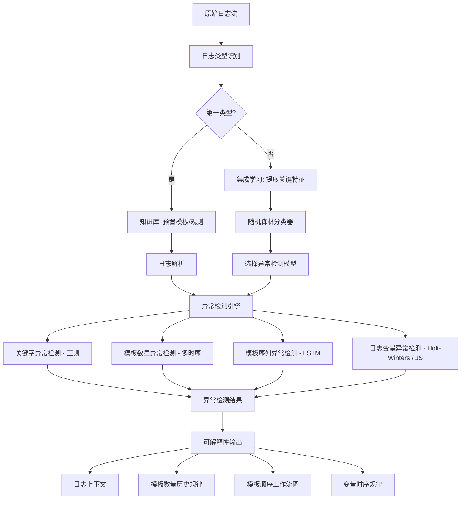
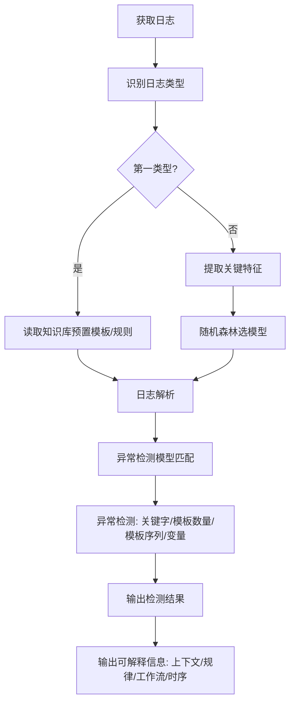

# 一种基于知识库和集成学习的日志异常检测方法与系统（CN115062144B）

> 申请人：北京必示科技有限公司
> 申请日：2022-05-26
> 公开/授权日：2025-01-21（授权公告日）
> IPC分类号：G06F 16/35 (2025.01); G06F 16/18 (2019.01); G06F 16/903 (2019.01); G06F 18/2431 (2023.01); G06F 18/22 (2023.01); G06F 18/2433 (2023.01); G06N 3/0442 (2023.01); G06N 3/08 (2023.01); G06N 5/022 (2023.01); G06N 20/20 (2019.01)
> 发明人：曹立、王泓琳、刘大鹏
> 关联文档：[同目录 CN115062144B.pdf](../../../CN115062144B.pdf)

## 一、文档信息速览

| 字段 | 值 |
|---|---|
| 专利号 | CN115062144B |
| 类型 | 授权发明专利（B） |
| 申请号 | 202210578307.4 |
| 申请日 | 2022-05-26 |
| 公开号 | CN115062144A |
| 公开/授权日 | 2025-01-21（授权公告日） |
| 申请人 | 北京必示科技有限公司 |
| 发明人 | 曹立、王泓琳、刘大鹏 |
| IPC | G06F 16/35; G06F 16/18; G06F 16/903; G06N 3/0442; G06N 3/08; G06N 5/022; G06N 20/20 |
| 法律状态 | 已授权 |

## 二、背景（Background）

本发明属于大数据分析与数据挖掘领域，聚焦于"日志异常检测（Log Anomaly Detection）"在生产环境中的实际落地。日志异常检测在服务可靠性与故障管理中具有重要意义：日志详细记录了系统的运行状态与用户行为，是异常行为检测、故障诊断的核心数据源。

传统监控中，工程师基于领域知识手工设置关键字与正则表达式来检测日志异常。但在现代大规模软件系统中：
- 服务规模与复杂度持续增长，每天日志量可达 TB 级；
- 手工规则耗时耗力、维护成本高；
- 不同工程师的规则标准不一，缺乏统一规范；
- 软件变更频繁，规则需要持续维护更新。

学术界已有的日志异常检测工作通常分五步：日志收集、模板解析、日志分组、特征提取、异常检测。然而，这些方法在生产环境中遇到显著挑战：
1. **日志类型多样与异常模式多样**：硬件、中间件、应用层日志差异大，已有方法仅在简单公开数据集上验证，难以应对实际生产环境中复杂的异常模式（关键字、模板数量、模板顺序、变量取值、变量分布、时间间隔、日志总量等）。
2. **可解释性差**：黑盒端到端算法难以让工程师理解"为什么异常"、"正常模式是什么"。
3. **缺乏领域知识融合**：已有工作忽略领域知识，无法针对每种日志类型选择最合适的异常检测算法。

本发明提出"基于知识库和集成学习"的日志异常检测框架，通过知识库存储常见日志模板、解析规则与异常检测算法映射，通过集成学习为未知类型日志自动选择最合适的异常检测模型，确保准确性与可解释性。

## 三、目的（Purpose / Problems Solved）

- **痛点 → 方案：日志类型与异常模式多样**：本方案针对 5 种常见异常模式（关键字、模板数量、模板顺序、变量取值、变量分布）设计专门的异常检测算法，按日志类型分派。
- **痛点 → 方案：未知类型日志难以处理**：本方案通过集成学习（随机森林分类器）自动为未知类型日志选择最合适的异常检测模型，无需人工干预。
- **痛点 → 方案：缺乏领域知识融合**：本方案通过知识库存储"日志类型 → 异常检测算法"映射，将领域知识显式编码。
- **痛点 → 方案：端到端黑盒不可解释**：本方案输出包含日志上下文、模板数量历史规律、模板顺序工作流图、变量时序规律等可解释信息。
- **痛点 → 方案：模板维护成本高**：知识库中预置常见日志模板（如 HDFS）与解析规则（如 accesslog），新日志接入时直接读取模板。

## 四、核心原理（Principles）

### 系统总览

本方案以"知识库 + 集成学习"为核心：
- **知识库**：存储常见日志模板、日志解析规则、日志类型与异常检测算法的映射；
- **集成学习**：通过随机森林分类器，基于日志关键特征（模板数量、实词数量、出现次数分布、模板相似度）自动为未知类型日志选择异常检测算法；
- **异常检测算法库**：包含 4 类异常检测模型——关键字异常检测（正则）、模板数量异常检测（多时间序列）、模板序列异常检测（LSTM）、日志变量异常检测（变量取值/分布）。

### 关键概念

- **知识库（Knowledge Base）**：存储三类信息——常见日志模板、日志解析规则、日志类型对应的异常检测算法。
- **第一类型日志**：通用日志、不适合模板解析的日志、具有关键变量的日志，使用预置模板或预置规则解析。
- **第二类型日志**：未知类型日志，使用集成学习自动选择异常检测模型。
- **集成学习（Ensemble Learning）**：通过随机森林分类器，根据日志关键特征（模板数量、模板中实词数量、模板出现次数分布、模板相似度）选择最合适的异常检测模型。
- **异常检测模型**：本方案包含 4 类——关键字异常检测模型（正则）、模板数量异常检测模型（多时序）、模板序列异常检测模型（LSTM）、日志变量异常检测模型（取值/分布）。
- **Jaccard 距离**：衡量模板之间相似性的指标，$J(A,B) = |A \cap B|/|A \cup B|$。

### 数学原理

#### 4.1 JS 散度（变量分布异常检测）

$$
JS(P \parallel Q) = \frac{1}{2} \cdot KL(P \parallel M) + \frac{1}{2} \cdot KL(Q \parallel M)
$$

其中 $M = \frac{1}{2}(P+Q)$，$KL$ 为 KL 散度。当 $JS > \tau$ 时认为分布异常。

#### 4.2 3-sigma / Holt-Winters（变量取值异常检测）

若时间序列有周期，采用 Holt-Winters 三参数指数平滑：

$$
\hat{y}_{t+h} = (l_t + h \cdot b_t) \cdot s_{t+h-s} + \epsilon_{t+h}
$$

否则用 3-sigma：

$$
|y_t - \mu| > 3\sigma \Rightarrow \text{异常}
$$

#### 4.3 LSTM 模板序列异常检测

输入是最近 $w$ 条日志的模板编号 $x_i$，模型输出 top-k 预测概率分布 $P(y_{i+1} \mid x_i)$：

$$
\text{异常} = \mathbb{I}\{P(\text{actual next template} \mid x_i) \notin \text{top-k}\}
$$

#### 4.4 多时间序列异常检测（模板数量）

将每类模板在每分钟出现的次数聚合成时间序列，对所有模板序列做整体多变量异常检测，LSTM 模型预测值与真实值的差距即为异常分数。

### 与现有技术的差异

| 维度 | 传统方案 | 本方案 |
|---|---|---|
| 异常检测算法 | 单一端到端 | 知识库 + 集成学习，按类型分派 |
| 未知类型日志 | 无法处理 | 随机森林自动选模型 |
| 领域知识融合 | 无 | 知识库显式编码 |
| 可解释性 | 黑盒 | 输出上下文、规律、工作流、时序 |
| 新日志接入成本 | 重训练 | 知识库读取模板 |

## 五、算法详解（Algorithm）

### 输入 / 输出

- **输入**：原始日志流（日志类型：JVM GC、DB2、HDFS、Oracle、accesslog 等）。
- **输出**：异常检测结果（异常 / 正常），包含日志上下文、模板数量历史规律、模板顺序工作流图、变量时序规律。

### 伪代码

```python
def log_anomaly_detection_pipeline(raw_log, kb):
    log_type = identify_log_type(raw_log)
    knowledge = kb.get(log_type)

    # 第一类型日志：使用预置模板/规则
    if knowledge and knowledge.has_template():
        parsed = parse_with_template(raw_log, knowledge.template)
        model = knowledge.algorithm
    else:
        # 第二类型日志：使用集成学习
        features = extract_features(raw_log)
        # features = [template_count, content_word_count, dist_of_template_freq,
        #             jaccard_similarity]
        model = random_forest_classifier(features)
        parsed = raw_log

    # 异常检测
    anomaly_result = model.detect(parsed)

    # 可解释性输出
    context = extract_context(parsed)
    template_history = get_template_history(template_id)
    workflow_graph = build_workflow(template_sequence)
    variable_ts = get_variable_timeseries(parsed)
    return {
        "anomaly": anomaly_result,
        "context": context,
        "template_history": template_history,
        "workflow_graph": workflow_graph,
        "variable_ts": variable_ts,
    }
```

### 关键数学

- **JS 散度**：用于变量分布异常检测；
- **3-sigma / Holt-Winters**：用于变量取值异常检测；
- **LSTM top-k 预测**：用于模板序列异常检测；
- **多时间序列 LSTM**：用于模板数量异常检测。

### 复杂度分析

- 日志类型识别：$O(1)$（基于规则）；
- 特征提取：$O(L)$，$L$ 为窗口内日志数；
- 随机森林分类：$O(K \cdot d)$，$K$ 为树数，$d$ 为特征维度；
- LSTM 模型推理：$O(w \cdot h)$，$w$ 为窗口大小，$h$ 为隐层维度；
- 多时间序列异常检测：$O(d \cdot T)$，$d$ 为模板数，$T$ 为时间步数。

### 示例

JVM GC 日志接入：
1. 知识库中存在 JVM GC 的预置模板（"\[GC \d+\.\d+ secs\]"），直接解析；
2. 抽取关键变量：heap 使用率（百分比数值）；
3. 使用变量取值异常检测模型（Holt-Winters 检测到 GC pause 时间异常）；
4. 输出异常 + 可解释信息：上下文日志、模板数量历史规律、工作流图、变量时序。

DB2 日志：
1. 关键字异常检测：正则匹配 "SQLCODE=-"；
2. 模板数量异常检测：每分钟 SQLCODE=-803（主键冲突）模板数量异常飙升。

HDFS 日志：
1. 模板序列异常检测：LSTM 预测下一条模板 top-k；
2. 若到达的日志模板不在 top-k 内（如 DataNode 故障恢复路径异常），判定为异常。

未知日志：
1. 特征提取（模板数量、实词数、次数分布、jaccard）；
2. 随机森林分类器输出最匹配算法（例如分到 JVM GC 类型）；
3. 使用该算法做异常检测。

## 六、系统架构图（Architecture）



## 七、流程图（Process Flow）



## 八、关键创新点（Key Innovations）

- **+ 知识库 + 集成学习架构**：知识库存储日志类型 → 异常检测算法的映射；集成学习（随机森林）为未知类型日志自动选择最合适的异常检测模型。
- **+ 多模型异常检测分派**：针对 5 类异常模式（关键字、模板数量、模板顺序、变量取值、变量分布）设计 4 类异常检测模型，按日志类型分派。
- **+ 可解释性输出**：不仅输出异常判定，还输出上下文、模板数量历史规律、模板顺序工作流图、变量时序规律，让工程师理解"为什么异常"。
- **+ 多变量异常检测**：对所有模板序列做整体多变量异常检测，避免对每个模板单独训练模型。
- **+ 预置模板与解析规则**：知识库预置常见日志模板（HDFS、accesslog 等），新日志接入时直接读取，降低维护成本。

## 九、权利要求摘要（Claims Summary）

- **独立权利要求 1（方法）**：
  1. 获取日志；
  2. 识别日志类型；
  3. 基于知识库对不同类型日志做不同预处理；
  4. 第一类型日志使用预置模板/规则解析；
  5. 第二类型日志使用集成学习处理（提取关键特征 + 随机森林分类）；
  6. 基于日志类型匹配异常检测模型；
  7. 输出检测结果。

- **独立权利要求 7（系统）**：获取单元、类型识别单元、知识库（日志预处理单元 + 模型匹配单元）、输出单元。

- **从属权利要求 2-6、8-10**：
  - 预处理为非结构化→结构化；
  - 关键特征：模板数量、模板中实词数、模板出现次数分布、模板相似性；
  - 异常检测模型：关键字（正则）、模板数量（多时序）、模板序列（LSTM）、变量取值（Holt-Winters / 3-sigma）、变量分布（JS 散度）；
  - 输出包含上下文、历史规律、工作流图、变量时序。

## 十、应用场景（Use Cases）

- **金融交易系统日志异常检测**：对 JVM GC、DB2、Oracle 等日志做异常检测，输出上下文与时序规律。
- **云原生微服务日志治理**：对 Kubernetes 集群的应用日志（accesslog、stdout/stderr）做异常检测，识别延迟飙升、错误率异常等。
- **大数据集群监控**：对 HDFS、HBase、Kafka 等大数据组件日志做异常检测，识别 DataNode 故障、broker 失效等。
- **电商订单系统异常检测**：对订单业务日志做模板序列异常检测，识别订单创建→支付→发货→售后流程中的异常分支。
- **电信运营商 BSS/OSS 日志异常检测**：对运营商业务系统日志做异常检测，自动选择最合适的异常检测算法。

## 十一、相关专利（Related Patents in this set）

- CN114785666B（一种网络故障排查方法与系统）
- CN114818643A（保留特定业务信息的日志模板提取方法）
- CN115391160B（异常变更检测方法、装置、设备及存储介质）
- CN115392403A（异常变更检测方法、装置、设备及存储介质）
- CN116302762A（基于红蓝对抗的故障定位应用的评测方法与系统）
- CN116820826A（基于调用链的根因定位方法、装置、设备及存储介质）

## 十二、术语表（Glossary）

- **集成学习**：Ensemble Learning，结合多个弱学习器构建强学习器的方法。
- **随机森林**：Random Forest，多棵决策树的集成学习方法。
- **LSTM**：Long Short-Term Memory，长短期记忆网络。
- **Jaccard 距离**：衡量集合相似度的指标。
- **JS 散度**：Jensen-Shannon Divergence，衡量两个概率分布之间相似度的指标。
- **3-sigma**：基于均值 3 倍标准差的异常检测方法。
- **Holt-Winters**：三参数指数平滑方法，用于时间序列预测。
- **PCA**：Principal Component Analysis，主成分分析。
- **HDFS**：Hadoop Distributed File System，Hadoop 分布式文件系统。
- **CMDB**：Configuration Management Database，配置管理数据库。

## 十三、参考与延伸阅读

- Xu, J., et al. "Unsupervised Labeled Data Construction for Log Anomaly Detection."
- Guo, H., et al. "LogBERT: Log Anomaly Detection via BERT."
- Du, M., et al. "Deep Learning for Generic Anomaly Detection in Time Series."
- 必示科技 AIOps 日志异常检测产品文档。
- 相关论文：基于 LSTM 的日志异常检测、模板序列异常检测、变量分布异常检测。