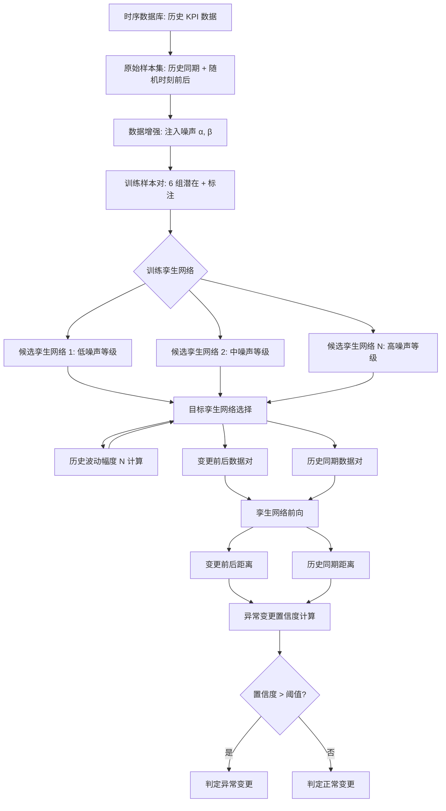
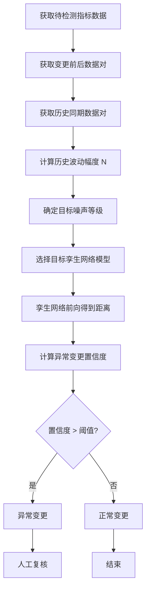

# 一种异常变更检测方法、装置、设备及存储介质（CN115391160B）

> 申请人：北京必示科技有限公司
> 申请日：2022-10-26
> 公开/授权日：2023-04-07（授权公告日）
> IPC分类号：G06F 11/34 (2006.01); G06F 18/241 (2023.01); G06F 18/22 (2023.01); G06N 3/0464 (2023.01)
> 发明人：温希道、曹立、汤汝鸣、聂晓辉、程世文
> 关联文档：[同目录 CN115391160B.pdf](../../../CN115391160B.pdf)

## 一、文档信息速览

| 字段 | 值 |
|---|---|
| 专利号 | CN115391160B |
| 类型 | 授权发明专利（B） |
| 申请号 | 202211314800.1 |
| 申请日 | 2022-10-26 |
| 公开号 | CN115391160A |
| 公开/授权日 | 2023-04-07（授权公告日） |
| 申请人 | 北京必示科技有限公司 |
| 发明人 | 温希道、曹立、汤汝鸣、聂晓辉、程世文 |
| IPC | G06F 11/34; G06F 18/241; G06F 18/22; G06N 3/0464 |
| 法律状态 | 已授权 |

## 二、背景（Background）

本发明涉及计算机技术领域，具体涉及一种异常变更检测方法、装置、设备及存储介质，应用于软件服务系统变更后的实时监控与异常检测场景。

随着软件系统日趋复杂，软件变更具有高频、不可避免、影响范围大等特点。即使有变更全流程监控，变更仍可能引入新问题，给厂商或客户带来经济损失。因此，变更后实时监控、检测变更后软件是否仍处于正常状态，是运维的关键场景。

业界有两大主流方法：
1. **基于对比的方法**：比较变更前后指标数据（KPI）是否相似，若差异较大则判定为异常变更。该方法缺点是没考虑不同类别指标的形态差异，准确率不高；某些基于距离计算的方法也导致效率过低。
2. **基于异常检测的方法**：用变更前的指标数据训练模型，再预测变更后的数据。该方法缺点是需要对每条指标训练单独的模型，训练开销过大。

本发明提出基于孪生网络（历史波动幅度驱动分类）+ 数据增强（噪声注入）的异常变更检测方案，按"历史波动幅度"对指标分类，仅需有限个孪生网络模型即可完成对所有数据对的处理，大幅降低训练资源。

## 三、目的（Purpose / Problems Solved）

- **痛点 → 方案：模型数量过多**：传统方法为每条指标单独训练模型。本方案按历史波动幅度对指标分类，仅需有限个孪生网络模型。
- **痛点 → 方案：训练样本标注成本高**：人工标注样本耗时。本方案通过对原始样本注入噪声生成训练样本，自动标注相似负例/不相似正例，避免人工。
- **痛点 → 方案：检测准确率不高**：传统方法不考虑不同类别指标的形态差异。本方案通过"历史同期距离 + 变更前后距离"加权计算异常变更置信度，结合两种参考距离提升准确性。
- **痛点 → 方案：网络结构不一致**：传统方法每个指标用不同模型，结构不一致，缺乏通用性。本方案不同候选孪生网络保持相同的神经网络结构。
- **痛点 → 方案：水位漂移被误判**：扩容场景下水位漂移是正常的，但传统方法会判为异常。本方案支持动态调整异常置信度阈值，适配扩容等场景。

## 四、核心原理（Principles）

### 系统总览

本方案以"孪生网络 + 历史波动幅度分类 + 数据增强"为核心：
1. **历史波动幅度分类**：根据指标数据的历史波动幅度（用 N 表示），将指标划分为多个噪声等级，每个等级对应一个候选孪生网络模型。
2. **孪生网络模型**：用结构相同的孪生网络（共享权重）学习"两个等长 KPI 序列是否相似"的能力，输出距离值。
3. **数据增强**：向原始样本注入不同幅度噪声生成增强样本，组对后自动标注为相似负例（噪声小）或不相似正例（噪声大）。
4. **异常变更置信度**：对历史同期距离与变更前后距离加权相加，与异常置信度阈值比较，得出异常变更判定结果。

### 关键概念

- **孪生网络（Siamese Network）**：两个共享权重的子网络，分别接收两个等长序列，输出特征后相减并通过距离函数输出距离值。
- **历史波动幅度 N**：指标数据在不同周期的波动幅度，量化方法见 §4.1。
- **历史同期数据**：历史变更上线后指标数据的周期性变化趋势。
- **变更前数据（稳定性指标）**：变更前指标数据的局部运行趋势。
- **历史同期距离**：变更后数据与历史同期数据通过孪生网络输出的距离。
- **变更前后距离**：变更后数据与变更前数据通过孪生网络输出的距离。
- **异常变更置信度**：历史同期距离与变更前后距离的加权和，与阈值比较得到异常判定。

### 数学原理

#### 4.1 历史波动幅度 N

$$
N = \frac{1}{T} \cdot \sum_{i=1}^{T} \operatorname{std}\!\left(X^{(i)}\right)
$$

为历史波动幅度 N 设置 i 个分级区间（$i \geq 2$），例如 $0-N_1$、$N_1-N_2$、...、$N_{i-1}-N_i$，$N_i > N_{i-1} > ... > N_1 > 0$，各分级区间与噪声等级一一对应，得到 i 个噪声等级。

#### 4.2 孪生网络距离函数

$$
D(x, x') = \text{ContrastiveLoss}(f(x) - f(x'))
$$

其中 $f(\cdot)$ 为子网络提取的特征，Contrastive Loss 形式为：

$$
L = \frac{1}{2} y D^2 + \frac{1}{2}(1 - y) \max(0, m - D)^2
$$

其中 $y \in \{0, 1\}$ 表示相似/不相似标签，$m$ 为边距。

#### 4.3 异常变更置信度

$$
\text{Confidence} = \alpha \cdot D_{\text{历史同期}} + \beta \cdot D_{\text{变更前后}}
$$

其中 $\alpha$、$\beta$ 为参考权重。当 Confidence > th 时判定为异常变更，否则为正常变更。

### 与现有技术的差异

| 维度 | 传统方案 | 本方案 |
|---|---|---|
| 模型数量 | 每条指标单独训练 | 有限个孪生网络（按 N 分类） |
| 训练样本 | 人工标注 | 数据增强 + 自动打标 |
| 网络结构一致性 | 差 | 候选模型结构一致 |
| 检测依据 | 单距离 | 历史同期距离 + 变更前后距离 |
| 水位漂移支持 | 误判 | 动态阈值调整 |

## 五、算法详解（Algorithm）

### 输入 / 输出

- **输入**：时序数据库中的历史 KPI 数据；当前变更前后数据。
- **输出**：异常变更检测结果（异常 / 正常）+ 异常变更置信度。

### 伪代码

```python
def anomaly_change_detection(target_kpi):
    # Step 1: 获取数据对
    pairs = get_data_pairs(target_kpi)
    # - 变更前后数据对 (变更后, 变更前)
    # - 历史同期数据对 (变更后, 历史同期数据)，可能多个

    # Step 2: 根据历史波动幅度确定目标孪生网络
    N = compute_historical_volatility(target_kpi)
    target_model = select_siamese_model(N, candidate_models)

    # Step 3: 用目标孪生网络计算距离
    for pair in pairs:
        distance = target_model.forward(pair.A, pair.B)

    # Step 4: 计算异常变更置信度
    d_hist = min(distance_history)  # 取多个历史同期距离的最小值
    d_change = distance_change
    confidence = alpha * d_hist + beta * d_change

    # Step 5: 异常判定
    return "异常变更" if confidence > threshold else "正常变更"


def train_siamese_model(N_level, training_set):
    """训练一个噪声等级 N_level 的孪生网络"""
    # 1. 取两个原始样本 (A, B) 历史同期/随机时刻前后
    # 2. 向 A 注噪声 α 得 A'，向 B 注噪声 β 得 B'
    # 3. 组对 (A,A') (A,B) (A,B') (B,A') (B,B') (A',B')
    # 4. 标注：(A,B)→相似负例
    #    注入噪声不大于标准噪声幅度 → 相似负例
    #    注入噪声大于标准噪声幅度 → 不相似正例
    #    (A',B') 跳过
    # 5. 训练孪生网络
    siamese_model = SiameseNetwork()
    for pair, label in training_pairs:
        loss = contrastive_loss(pair.A, pair.B, label)
        siamese_model.train_step(loss)
    return siamese_model
```

### 关键数学

- 历史波动幅度 N（极差/标准差统计）：用于指标分类；
- 孪生网络 Contrastive Loss：用于相似度学习；
- 异常变更置信度：加权求和 + 阈值判定。

### 复杂度分析

- 历史波动幅度计算：$O(T)$，$T$ 为周期数；
- 孪生网络前向：$O(L)$，$L$ 为序列长度；
- 异常变更置信度计算：$O(1)$；
- 整体开销：随 KPI 数线性增长，适用于大型系统。

### 示例

某服务系统做了一次扩容变更（节点 99 → 100）：
1. **变更后数据**：节点 100-101 时段的 KPI（响应时间、吞吐量）；
2. **变更前数据**：节点 99-100 时段 KPI（局部稳定性数据）；
3. **历史同期数据**：节点 10-11、20-21、...、90-91 中任一历史同期 KPI；
4. **历史波动幅度 N**：节点 100 指标的历史波动幅度落入 N_2 区间，对应候选孪生网络模型 M_2；
5. **孪生网络推理**：
   - 历史同期距离：变更后与历史同期距离 ∈ {0.05, 0.08, ...}，取最小 = 0.05；
   - 变更前后距离：变更后与变更前距离 = 0.6（较大，因扩容导致水位漂移）；
6. **置信度**：confidence = 0.4 × 0.05 + 0.6 × 0.6 = 0.38；
7. **阈值判定**：threshold = 0.5，confidence 0.38 < 0.5，判定为正常变更（扩容场景符合预期）；
8. **动态调整**：若为重要更新，threshold 调整至 0.3，则 0.38 > 0.3，判定为异常变更。

## 六、系统架构图（Architecture）



## 七、流程图（Process Flow）



## 八、关键创新点（Key Innovations）

- **+ 历史波动幅度驱动的指标分类**：根据 N 将指标划分为多个噪声等级，每个等级对应一个孪生网络模型，大幅减少模型数量。
- **+ 数据增强自动打标**：向原始样本注入不同幅度噪声生成增强样本，组对后根据"注入噪声幅度 vs 标准噪声幅度"自动标注相似负例/不相似正例，避免人工标注。
- **+ 候选孪生网络结构一致**：所有候选孪生网络保持相同神经网络结构，仅训练样本的噪声等级不同，提升通用性。
- **+ 双距离融合置信度**：结合历史同期距离与变更前后距离计算异常变更置信度，更全面地反映变更后状态。
- **+ 动态阈值适配水位漂移**：异常置信度阈值可动态调整，扩容等水位漂移场景下可适配。

## 九、权利要求摘要（Claims Summary）

- **独立权利要求 1（方法）**：
  1. 获取历史同期数据检测对和变更前后数据检测对；
  2. 根据历史波动幅度从至少两个候选孪生网络模型中确定目标孪生网络模型；
  3. 将数据对分别输入目标孪生网络，得到历史同期距离和变更前后距离；
  4. 根据历史同期距离和变更前后距离确定异常变更检测结果。

- **独立权利要求 5（装置）**：参考数据对获取模块、网络模型确定模块、参考距离生成模块、异常变更检测模块。
- **独立权利要求 6（电子设备）** / **独立权利要求 7（存储介质）**：标准硬件与介质权利要求。

- **从属权利要求 2-4**：
  - 不相似正例 vs 相似负例的训练目标；
  - 历史同期数据样本与随机时刻前后数据样本；
  - 异常变更置信度加权求和 + 阈值判定。

## 十、应用场景（Use Cases）

- **金融交易系统变更监控**：在版本更新后实时检测异常变更，输出异常变更置信度。
- **云原生微服务滚动升级**：在 Kubernetes 滚动升级场景下，对每次变更做异常检测，识别回滚窗口。
- **电商大促前容量扩容**：在扩容场景下，通过动态阈值适配水位漂移，避免误判。
- **运营商业务系统变更**：在 BSS/OSS 变更后实时监控 KPI，识别异常变更。
- **大型数据中心运维**：在多节点变更场景下，对每个节点的历史同期/变更前后距离做异常检测。

## 十一、相关专利（Related Patents in this set）

- CN114785666B（一种网络故障排查方法与系统）
- CN114818643A（保留特定业务信息的日志模板提取方法）
- CN115062144B（基于知识库和集成学习的日志异常检测方法与系统）
- CN115392403A（异常变更检测方法、装置、设备及存储介质）
- CN116302762A（基于红蓝对抗的故障定位应用的评测方法与系统）
- CN116820826A（基于调用链的根因定位方法、装置、设备及存储介质）

## 十二、术语表（Glossary）

- **孪生网络**：Siamese Network，两个共享权重的子网络，用于度量输入对相似度。
- **Contrastive Loss**：对比损失，用于孪生网络的相似度学习。
- **历史波动幅度 N**：指标数据在不同周期的波动幅度。
- **历史同期数据**：历史变更上线后指标数据的周期性变化趋势。
- **变更前数据**：变更前指标数据的局部运行趋势。
- **数据增强**：Data Augmentation，通过对原始样本注入噪声生成增强样本。
- **水位漂移**：Level Shift，扩容场景下指标整体水位变化。
- **KPI**：关键绩效指标。
- **CMDB**：Configuration Management Database。
- **置信度阈值**：Confidence Threshold，用于异常判定的阈值。

## 十三、参考与延伸阅读

- Chopra, S., et al. "Learning a Similarity Metric Discriminatively, with Application to Face Verification."
- Kedzie, C., et al. "A Good Sample is Hard to Find: Noise Injection Sampling and Self-Training for Neural Language Generation Models."
- 必示科技 AIOps 变更监控产品文档。
- 相关论文：基于孪生网络的时序相似度学习、数据增强在异常检测中的应用。