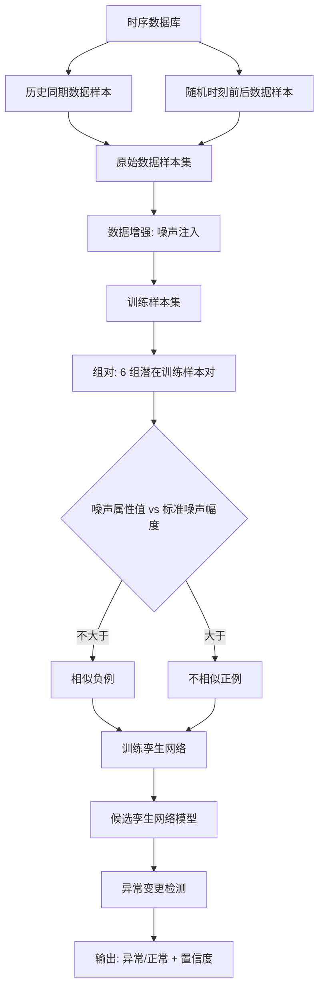
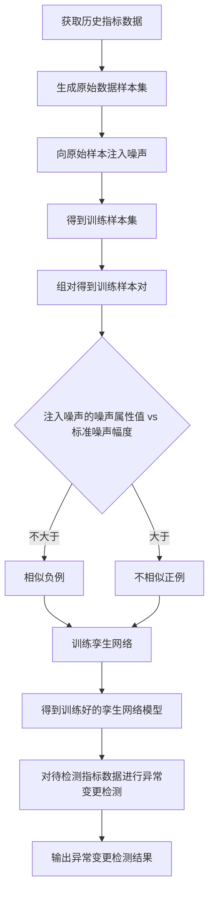

# 一种异常变更检测方法、装置、设备及存储介质（CN115392403A）

> 申请人：北京必示科技有限公司
> 申请日：2022-10-26
> 公开/授权日：2022-11-25（公开日）
> IPC分类号：G06K 9/62 (2022.01); G06N 3/08 (2006.01)
> 发明人：温希道、曹立、汤汝鸣、聂晓辉、程世文
> 关联文档：[同目录 CN115392403A.pdf](../../../CN115392403A.pdf)

## 一、文档信息速览

| 字段 | 值 |
|---|---|
| 专利号 | CN115392403A |
| 类型 | 发明专利申请（A） |
| 申请号 | 202211314781.2 |
| 申请日 | 2022-10-26 |
| 公开号 | CN115392403A |
| 公开/授权日 | 2022-11-25（公开日） |
| 申请人 | 北京必示科技有限公司 |
| 发明人 | 温希道、曹立、汤汝鸣、聂晓辉、程世文 |
| IPC | G06K 9/62; G06N 3/08 |
| 法律状态 | 公开，实质审查中 |

## 二、背景（Background）

本发明涉及计算机技术领域，具体涉及一种异常变更检测方法、装置、设备及存储介质。本发明与同申请人的 CN115391160B 同日申请，且具有相同的发明人和高度重叠的技术领域，但侧重点不同：CN115391160B 聚焦于"基于历史波动幅度分类的孪生网络选取"，本发明聚焦于"基于数据增强（噪声注入）的训练样本自动打标"。

在 CN115391160B 的基础上，本发明进一步详细化了以下内容：
1. **训练样本生成流程**：从历史同期数据样本和随机时刻前后数据样本生成原始数据样本集，向原始样本注入不同类型的噪声（噪声幅度、噪声位置、噪声种类），根据注入噪声的噪声属性值自动为训练样本对打标；
2. **多种噪声注入方式**：水位漂移、高斯噪声、短暂脉冲噪声、突增突降、稳定变化，前三者保持相似，后两者导致不相似；
3. **孪生网络训练**：根据训练样本对和训练标签对孪生网络模型进行训练，得到变更异常检测结果。

整体上，本发明与 CN115391160B 是孪生兄弟专利，共同构成完整的异常变更检测方案。

## 三、目的（Purpose / Problems Solved）

- **痛点 → 方案：训练样本标注效率低**：人工标注样本耗时耗力。本方案通过对原始样本注入噪声生成训练样本，根据注入噪声的噪声属性值自动打标，提高样本标注效率，降低标注成本。
- **痛点 → 方案：模型泛化性差**：传统异常检测方法对每条指标训练单独模型。本方案通过基于历史波动幅度对指标分类，仅需有限个孪生网络模型。
- **痛点 → 方案：注入噪声类型单一**：传统方法只使用一种或少数几种注入噪声。本方案提供 5 种注入噪声方式（水位漂移、高斯噪声、短暂脉冲、突增突降、稳定变化），更全面。
- **痛点 → 方案：相似/不相似判定标准不明确**：传统方法难以判断增强样本与原始样本是否相似。本方案通过噪声属性值（幅度、位置、种类）与标准噪声幅度的比较，自动判定相似/不相似。
- **痛点 → 方案：噪声属性与噪声等级关联弱**：传统方法没有显式建立"指标噪声等级 ↔ 标准噪声幅度"的映射。本方案通过历史波动幅度确定噪声等级，再确定标准噪声幅度。

## 四、核心原理（Principles）

### 系统总览

本方案以"数据增强 + 噪声属性驱动打标 + 孪生网络训练"为核心：
1. **原始样本集生成**：从时序数据库中取出历史同期数据样本和随机时刻前后数据样本，作为成对的原始样本。
2. **数据增强（噪声注入）**：向原始样本注入不同类型的噪声，得到训练样本集。
3. **训练样本对组对 + 自动打标**：根据注入噪声的噪声属性值（幅度、位置、种类）自动标注训练样本对（相似负例 / 不相似正例）。
4. **孪生网络训练**：根据训练样本对和训练标签训练孪生网络模型。
5. **变更异常检测**：将待检测指标数据（变更后）与历史同期数据、变更前数据分别组成数据对，输入孪生网络得到距离，输出异常检测结果。

### 关键概念

- **历史同期数据样本**：由时序数据库中同一历史周期位置的时间长度相同的指标数据组成（如节点 22-23 与 32-33）。
- **随机时刻前后数据样本**：由任意随机节点时刻之前和之后时间长度相同的指标数据组成（如节点 7-8 与 8-9）。
- **增强样本**：通过对原始样本注入噪声得到的样本。
- **相似负例**：两个训练样本相似的样本对，标签为"相似"。
- **不相似正例**：两个训练样本不相似的样本对，标签为"不相似"。
- **噪声属性值**：注入噪声的特征描述，至少包括噪声幅度、噪声位置、噪声种类。
- **目标噪声等级**：原始样本所属指标数据根据历史波动幅度确定的噪声等级。
- **目标标准噪声幅度**：目标噪声等级对应的标准噪声幅度。

### 数学原理

#### 4.1 历史波动幅度 N（同 CN115391160B）

$$
N = \frac{1}{T} \cdot \sum_{i=1}^{T} \operatorname{std}\!\left(X^{(i)}\right)
$$

#### 4.2 噪声属性值判定相似/不相似

若注入噪声的噪声幅度不大于目标标准噪声幅度，则判定为相似负例：

$$
\text{label}(pair) = \begin{cases}
\text{相似负例} & \text{if } \text{noise\_amp} \leq \text{std\_noise\_amp} \\
\text{不相似正例} & \text{if } \text{noise\_amp} > \text{std\_noise\_amp}
\end{cases}
$$

#### 4.3 孪生网络距离函数（同 CN115391160B）

$$
D(x, x') = \text{ContrastiveLoss}(f(x) - f(x'))
$$

#### 4.4 异常变更置信度（同 CN115391160B）

$$
\text{Confidence} = \alpha \cdot D_{\text{历史同期}} + \beta \cdot D_{\text{变更前后}}
$$

### 与现有技术的差异

| 维度 | 传统方案 | 本方案 |
|---|---|---|
| 训练样本标注 | 人工 | 数据增强 + 自动打标 |
| 注入噪声类型 | 单一 | 5 种（水位漂移、高斯、短暂脉冲、突增突降、稳定变化） |
| 相似/不相似判定 | 启发式 | 基于噪声属性值 vs 标准噪声幅度 |
| 孪生网络训练 | 人工标注数据 | 自动标注训练样本对 |
| 通用性 | 弱 | 通用性强 |

## 五、算法详解（Algorithm）

### 输入 / 输出

- **输入**：时序数据库中的历史指标数据。
- **输出**：变更异常检测结果（异常 / 正常）+ 训练好的孪生网络模型。

### 伪代码

```python
def generate_training_set(historical_data):
    # Step 1: 生成原始数据样本集
    raw_samples = []
    for ts_data in historical_data:
        # 历史同期数据样本: 节点22-23 vs 32-33
        for i in range(0, len(ts_data) - 2, 2):
            raw_samples.append((ts_data[i:i+2], ts_data[i+10:i+12]))
        # 随机时刻前后数据样本: 节点7-8 vs 8-9
        for j in range(len(ts_data) - 2):
            raw_samples.append((ts_data[j:j+2], ts_data[j+1:j+3]))
    return raw_samples


def inject_noise(sample, noise_type, amplitude):
    """注入指定类型的噪声，返回增强样本"""
    if noise_type == 'level_shift':
        return sample + amplitude  # 水位漂移
    elif noise_type == 'gaussian':
        return sample + np.random.normal(0, amplitude, len(sample))
    elif noise_type == 'transient':
        idx = np.random.randint(0, len(sample))
        sample[idx] += amplitude  # 短暂脉冲
        return sample
    elif noise_type == 'ramping':
        return sample + amplitude * np.arange(len(sample))
    elif noise_type == 'steady':
        return sample * (1 + amplitude)
    return sample


def generate_training_pairs(raw_samples):
    """从原始样本生成训练样本对并自动打标"""
    training_pairs = []
    for A, B in raw_samples:
        # 对每个原始对，分别注入两种噪声
        A_p = inject_noise(A, noise_type=random.choice(NOISE_TYPES), amplitude=random.random())
        B_p = inject_noise(B, noise_type=random.choice(NOISE_TYPES), amplitude=random.random())

        # 组对 + 打标
        # 1. (A, B) → 相似负例
        training_pairs.append(((A, B), 'similar'))

        # 2. (A, A_p), (B, A_p), (A, B_p), (B, B_p) → 根据噪声幅度 vs 标准噪声幅度打标
        std_noise = compute_std_noise(A, B)  # 根据 A/B 的历史波动幅度计算
        for pair in [(A, A_p), (B, A_p), (A, B_p), (B, B_p)]:
            noise_amp = extract_noise_amp(pair)
            label = 'similar' if noise_amp <= std_noise else 'dissimilar'
            training_pairs.append((pair, label))

        # 3. (A_p, B_p) 跳过
    return training_pairs


def train_siamese(training_pairs):
    """根据训练样本对训练孪生网络"""
    model = SiameseNetwork()
    for (x1, x2), label in training_pairs:
        loss = contrastive_loss(model.forward(x1), model.forward(x2), label)
        model.train_step(loss)
    return model


def anomaly_change_detection(target_kpi, trained_model):
    """使用训练好的孪生网络进行异常变更检测"""
    pairs = get_data_pairs(target_kpi)
    distances = [trained_model.forward(p.A, p.B) for p in pairs]
    confidence = alpha * min(distances[:history]) + beta * distances[-1]
    return "异常变更" if confidence > threshold else "正常变更"
```

### 关键数学

- 历史波动幅度 N（极差/标准差统计）：用于指标分类；
- 噪声属性值判定：基于"注入噪声幅度 vs 目标标准噪声幅度"；
- 孪生网络 Contrastive Loss：用于相似度学习；
- 异常变更置信度：加权求和 + 阈值判定。

### 复杂度分析

- 原始样本生成：$O(N)$，$N$ 为时序数据库大小；
- 噪声注入：$O(L)$，$L$ 为序列长度；
- 训练样本对组对：$O(M)$，$M$ 为原始样本数；
- 孪生网络训练：$O(K \cdot M)$，$K$ 为训练轮数；
- 异常变更检测：$O(L)$（单次前向）。

### 示例

1. **原始样本**：从时序数据库中取出节点 22-23（数据 A）与 32-33（数据 B）作为历史同期数据样本；从节点 7-8 与 8-9 中取出随机时刻前后数据样本。
2. **数据增强**：向 A 注入噪声 α（如 Gaussian noise 强度 0.05）得到 A'；向 B 注入噪声 β（如 LevelShift 强度 0.3）得到 B'。
3. **组对 + 打标**：
   - (A, B) → 相似负例；
   - (A, A')：注入幅度 0.05 ≤ 标准幅度 0.1 → 相似负例；
   - (A, B')：注入幅度 0.3 > 标准幅度 0.1 → 不相似正例；
   - (B, B')：注入幅度 0.3 > 标准幅度 0.1 → 不相似正例；
   - (A', B') 跳过。
4. **训练孪生网络**：用上述训练样本对训练孪生网络。
5. **异常变更检测**：将待检测指标数据（变更后）与历史同期数据、变更前数据分别组成数据对，输入孪生网络得到距离，输出异常检测结果。

## 六、系统架构图（Architecture）



## 七、流程图（Process Flow）



## 八、关键创新点（Key Innovations）

- **+ 数据增强自动打标**：通过对原始样本注入不同类型噪声（5 种），根据注入噪声的噪声属性值（幅度、位置、种类）自动为训练样本对打标，避免人工标注。
- **+ 5 种噪声注入方式**：水位漂移、高斯噪声、短暂脉冲噪声、突增突降、稳定变化，前三者保持相似，后两者导致不相似，更全面地模拟实际场景。
- **+ 噪声属性值与标准噪声幅度比较**：通过显式比较"注入噪声幅度 vs 标准噪声幅度"自动判定相似/不相似，标准噪声幅度通过历史波动幅度确定。
- **+ 候选孪生网络结构一致**：所有候选孪生网络保持相同神经网络结构，仅训练样本的噪声等级不同，提升通用性。
- **+ 与 CN115391160B 互补**：本发明聚焦于训练样本自动打标，CN115391160B 聚焦于历史波动幅度分类，二者共同构成完整的异常变更检测方案。

## 九、权利要求摘要（Claims Summary）

- **独立权利要求 1（方法）**：
  1. 根据历史指标数据中历史同期数据样本和随机时刻前后数据样本，生成原始数据样本集；
  2. 向原始样本注入噪声，得到训练样本集；
  3. 组对得到训练样本对，根据注入噪声的噪声属性值确定训练标签；
  4. 训练孪生网络模型，根据训练完成的模型对待检测指标数据进行处理，得到变更的异常检测结果。

- **独立权利要求 8（装置）**：原始样本生成模块、训练样本生成模块、训练样本标注模块、变更异常检测模块。
- **独立权利要求 9（电子设备）** / **独立权利要求 10（存储介质）**：标准硬件与介质权利要求。

- **从属权利要求 2-7**：
  - 噪声属性值：噪声幅度、噪声位置、噪声种类；
  - 训练样本对的组对规则（相似负例 / 不相似正例）；
  - 历史波动幅度确定目标噪声等级。

## 十、应用场景（Use Cases）

- **金融交易系统变更监控**：在版本更新后实时检测异常变更。
- **云原生微服务滚动升级**：在 Kubernetes 滚动升级场景下，对每次变更做异常检测。
- **电商大促前容量扩容**：在扩容场景下，通过动态阈值适配水位漂移。
- **运营商业务系统变更**：在 BSS/OSS 变更后实时监控 KPI。
- **大型数据中心运维**：在多节点变更场景下，对每个节点做异常检测。
- **数据增强通用场景**：本方案的数据增强与自动打标方法可推广至其他需要样本生成的机器学习场景。

## 十一、相关专利（Related Patents in this set）

- CN114785666B（一种网络故障排查方法与系统）
- CN114818643A（保留特定业务信息的日志模板提取方法）
- CN115062144B（基于知识库和集成学习的日志异常检测方法与系统）
- CN115391160B（异常变更检测方法、装置、设备及存储介质）— 本发明的孪生兄弟专利
- CN116302762A（基于红蓝对抗的故障定位应用的评测方法与系统）
- CN116820826A（基于调用链的根因定位方法、装置、设备及存储介质）

## 十二、术语表（Glossary）

- **孪生网络**：Siamese Network，两个共享权重的子网络。
- **Contrastive Loss**：对比损失，用于孪生网络的相似度学习。
- **数据增强**：Data Augmentation，通过对原始样本注入噪声生成增强样本。
- **噪声属性值**：Noise Attribute，注入噪声的特征描述（幅度、位置、种类）。
- **相似负例**：Similar Negative，两个训练样本相似的样本对。
- **不相似正例**：Dissimilar Positive，两个训练样本不相似的样本对。
- **水位漂移**：Level Shift。
- **高斯噪声**：Gaussian Noise。
- **短暂脉冲噪声**：Transient Noise。
- **标准噪声幅度**：Standard Noise Amplitude，对应噪声等级的最高幅度正常波动。

## 十三、参考与延伸阅读

- Chopra, S., et al. "Learning a Similarity Metric Discriminatively, with Application to Face Verification."
- Kedzie, C., et al. "A Good Sample is Hard to Find: Noise Injection Sampling and Self-Training for Neural Language Generation Models."
- 必示科技 AIOps 变更监控产品文档。
- 相关论文：基于孪生网络的时序相似度学习、数据增强在异常检测中的应用。