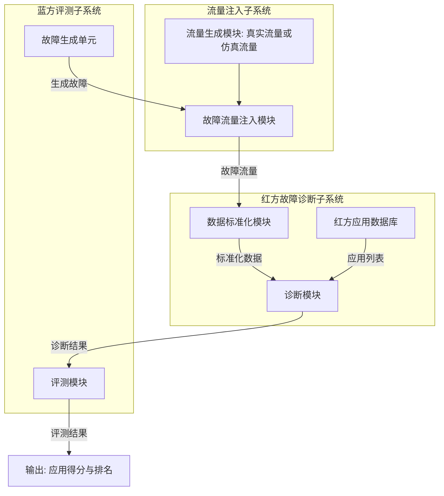
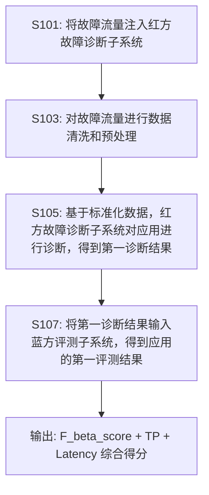

# 一种基于红蓝对抗的故障定位应用的评测方法与系统（CN116302762A）

> 申请人：北京必示科技有限公司
> 申请日：2023-05-12
> 公开/授权日：2023-06-23（公开日）
> IPC分类号：G06F 11/22 (2006.01); G06F 11/26 (2006.01); G06F 11/07 (2006.01); G06F 11/34 (2006.01); G06Q 10/0639 (2023.01)
> 发明人：陈哲康、温希道、汤汝鸣、聂晓辉、程世文
> 关联文档：[同目录 CN116302762A.pdf](../../../CN116302762A.pdf)

## 一、文档信息速览

| 字段 | 值 |
|---|---|
| 专利号 | CN116302762A |
| 类型 | 发明专利申请（A） |
| 申请号 | 202310532288.6 |
| 申请日 | 2023-05-12 |
| 公开号 | CN116302762A |
| 公开/授权日 | 2023-06-23（公开日） |
| 申请人 | 北京必示科技有限公司 |
| 发明人 | 陈哲康、温希道、汤汝鸣、聂晓辉、程世文 |
| IPC | G06F 11/22; G06F 11/26; G06F 11/07; G06F 11/34; G06Q 10/0639 |
| 法律状态 | 公开，实质审查中 |

## 二、背景（Background）

本发明属于计算机系统工程领域，具体涉及一种基于红蓝对抗的故障定位应用的评测方法与系统。

红蓝对抗（Red Team vs Blue Team）是混沌工程（Chaos Engineering）的重要组成部分。其思想源自 Jesse Robbins 在亚马逊创造的 GameDay 工具，通过有目的地定期创建重大故障来提高系统可靠性以及混沌工程的价值。GameDay 通常运行 2-4 小时，涉及开发应用程序或支持它的工程师团队，理想情况下涉及双方成员。

红蓝对抗的实施目标是帮助业务系统进行全面摸底，也是对业务系统稳定性建设目标的集中验证。Gremlin 等公司推广了 chaos gameday 实践，但在故障注入上做了较多工作，却未关注对抗过程中蓝方对各种故障的评测过程和标准，以及对红方算法的评测过程和标准。

本发明由此提出"基于红蓝对抗的故障定位应用评测"框架，在兼顾故障种类的同时，对故障的评测标准和红方算法的评测标准进行详细制定，量化各种算法的优劣程度和各种故障的严重程度，使评测更加客观、结论更加精确。

## 三、目的（Purpose / Problems Solved）

- **痛点 → 方案：缺乏量化评测标准**：传统混沌工程只关注故障注入，不关注评测过程。本方案对评测标准（准确率、速度）和红方算法标准进行详细制定。
- **痛点 → 方案：答案多对的少/少速度快**：传统方法难以平衡准确率与速度。本方案通过 F_beta_score（β=0.5）惩罚答案多对的少的情况，TP 惩罚答案少速度快的情况。
- **痛点 → 方案：得分分布不均**：传统排名方法可能导致得分集中在某些应用。本方案通过 ceil 函数平滑处理，k 经验参数调整得分分布。
- **痛点 → 方案：难以适配多种数据源**：传统方法只支持单一数据类型。本方案支持监控日志、监控指标、调用链数据三种标准化数据。
- **痛点 → 方案：仿真/真实流量难以统一**：传统方法难以同时使用真实流量与仿真流量。本方案通过统一标准化模块处理两种流量。

## 四、核心原理（Principles）

### 系统总览

本方案基于"红蓝对抗"架构：

```
[流量注入子系统]  --> [红方故障诊断子系统]  --> [蓝方评测子系统]
  - 流量生成              - 数据标准化              - 故障生成单元
  - 故障流量注入           - 红方应用数据库          - 评测模块
                          - 诊断模块
```

### 关键概念

- **红方（Red Team）**：执行故障诊断的应用方，在评测场景下是待评测对象。
- **蓝方（Blue Team）**：执行故障注入和评测的一方，本方案中对应蓝方评测子系统。
- **chaosblade**：阿里开源的混沌工程工具，用于故障注入。
- **F_beta_score**：F 分数，定义为精确率和召回率的加权调和平均，β 越小越强调精确率。
- **TP（True Positive）**：命中的 [cmdb_id, kpi_name] 数量。
- **Latency**：故障定位耗时，从故障发生到应用提交答案的时间。
- **[cmdb_id, kpi_name]**：CMDB 中的实体 ID 与对应的关键指标名称，表征根因。

### 数学原理

#### 4.1 故障定位耗时 Latency

$$
\text{Latency} = t - T_i
$$

其中 $t$ 为应用提交答案时间，$T_i$ 为第 $i$ 次故障发生时间。

#### 4.2 单次故障定位效果 $E_i$

$$
E_i = \text{ceil}\left(\frac{k \cdot F_{0.5\text{-score}} \cdot \text{TP}}{\text{Latency}}\right)
$$

其中：
- ceil 为取上整函数，用于忽略微小差距；
- $F_{0.5\text{-score}}$ 用于惩罚答案多对的少的情况；
- TP 用于惩罚答案少速度快的情况；
- Latency 用于评估应用时间；
- $k$ 为经验参数，根据成绩分布调整，使得分分布平滑。

#### 4.3 最终应用总得分

$$
\text{Score} = \sum_{i=1}^{N} \text{rank}_i
$$

将每个应用得到的 $E_i$ 按从小到大排序，前 10 名按名次从 10 分到 1 分递减；$E_i$ 为无穷（应用未命中或未提交）的应用第 $i$ 次故障得分为 0。

### 与现有技术的差异

| 维度 | Chaos Gameday / Gremlin | 本方案 |
|---|---|---|
| 故障注入 | 支持 | 支持 |
| 评测标准 | 无 | F_beta_score + TP + Latency 综合 |
| 评分量化 | 无 | ceil + k 平滑 |
| 数据源 | 单一 | 监控日志 + 监控指标 + 调用链 |
| 红蓝对抗 | 仅注入 | 注入 + 诊断 + 评测闭环 |

## 五、算法详解（Algorithm）

### 输入 / 输出

- **输入**：待评测应用列表、故障注入列表、标准化数据接口。
- **输出**：每个应用的评测得分 + 排名。

### 伪代码

```python
def evaluate_application(app, fault_set, blue_team):
    """对单个应用进行评测，返回每个故障的定位效果"""
    results = []
    for fault in fault_set:
        # 1. 蓝方注入故障
        blue_team.inject(fault)

        # 2. 红方应用诊断，得到答案
        start_time = fault.start_time
        # 收集在 [start_time, start_time + 10min] 内应用最后一次提交的答案
        answers = app.get_latest_answers_in_window(start_time, window=10*60)

        # 3. 计算 Latency
        t = answers.submission_time
        latency = t - start_time

        # 4. 计算 F_beta_score
        standard_answers = fault.standard_answers  # 标准答案
        f_score = compute_f_beta(answers.results, standard_answers, beta=0.5)

        # 5. 计算 TP（命中数）
        tp = count_hits(answers.results, standard_answers)

        # 6. 计算 E_i
        if f_score == 0 or tp < len(standard_answers) / 2:
            E_i = float('inf')  # 视为无穷
        else:
            k = smoothing_parameter()  # 经验参数
            E_i = ceil(k * f_score * tp / latency)

        results.append(E_i)
    return results


def compute_final_score(all_E_i):
    """将 E_i 排序，按名次打分"""
    ranked = sorted(enumerate(all_E_i), key=lambda x: x[1])
    scores = {}
    for rank, (app_id, E_i) in enumerate(ranked[:10]):
        scores[app_id] = 10 - rank  # 第 1 名得 10 分
    # E_i 为无穷的应用该次得 0 分
    return scores
```

### 关键数学

- Latency：故障定位耗时；
- F_beta_score：综合精确率和召回率；
- E_i：单次故障定位效果；
- Score：最终总得分。

### 复杂度分析

- 故障注入：$O(1)$；
- 单次故障评测：$O(A)$，$A$ 为应用诊断耗时；
- 总评测：$O(N \cdot A)$，$N$ 为故障数。

### 示例

对 3 个应用 A、B、C 做红蓝对抗评测，注入 10 次故障：

| 故障 | 应用 A 答案 | 应用 B 答案 | 应用 C 答案 | A F_score | B F_score | C F_score | A TP | B TP | C TP | A Latency | B Latency | C Latency |
|---|---|---|---|---|---|---|---|---|---|---|---|---|
| 1 | [(cmdb1, kpi1)] | [(cmdb1, kpi1)] | [] | 1.0 | 1.0 | 0 | 1 | 1 | 0 | 30s | 45s | 0 |
| 2 | [(cmdb2, kpi2)] | [(cmdb2, kpi3)] | [(cmdb2, kpi2)] | 1.0 | 0.5 | 1.0 | 1 | 0 | 1 | 60s | 30s | 50s |

假设标准答案为 [(cmdb1, kpi1)] 和 [(cmdb2, kpi2)]：
- 故障 1：A 答中 1 个 → F_score=1.0, TP=1；B 同；C 没答案 → F_score=0
- 故障 2：A 答中 1 个 → F_score=1.0, TP=1；B 答错 kpi → F_score=0.5, TP=0；C 答中 1 个 → F_score=1.0, TP=1

设 k=10，A 在故障 1 的 E_1 = ceil(10 × 1.0 × 1 / 30) = 1；故障 2 的 E_2 = ceil(10 × 1.0 × 1 / 60) = 1。B 在故障 1 的 E_1 = ceil(10 × 1.0 × 1 / 45) = 1；故障 2 的 E_2 = ceil(10 × 0.5 × 0 / 30) = 0。C 在故障 1 的 E_1 = ∞；故障 2 的 E_2 = ceil(10 × 1.0 × 1 / 50) = 1。

最终：A 总得分 = 1+1 = 2；B 总得分 = 1+0 = 1；C 总得分 = 0+1 = 1。

排名：A 第 1（10 分）、B 第 2（9 分）、C 第 3（8 分）。

## 六、系统架构图（Architecture）



## 七、流程图（Process Flow）



## 八、关键创新点（Key Innovations）

- **+ 红蓝对抗评测框架**：在混沌工程的故障注入基础上，加入蓝方对故障的评测过程与对红方算法的评测过程，量化各种算法的优劣程度和各种故障的严重程度。
- **+ 综合评分公式 E_i**：通过 $F_{0.5\text{-score}}$、TP、Latency 三要素综合评判，平衡准确率与速度，避免单一维度的偏颇。
- **+ k 经验参数平滑**：通过 ceil 函数 + k 经验参数调整得分分布，使排名更具区分度。
- **+ 多数据源支持**：同时支持监控日志（flume/logstash）、监控指标（Prometheus）、调用链（Jaeger + Elasticsearch）三种标准化数据。
- **+ 仿真/真实流量统一**：通过统一标准化模块处理真实流量与仿真流量，使评测可重复、可回放。

## 九、权利要求摘要（Claims Summary）

- **独立权利要求 1（方法）**：
  - S101：将故障流量注入红方故障诊断子系统；
  - S103：对故障流量进行数据清洗和预处理，得到标准化数据；
  - S105：基于标准化数据，红方故障诊断子系统对应用进行诊断，得到第一诊断结果；
  - S107：将第一诊断结果输入蓝方评测子系统，得到应用的第一评测结果。

- **独立权利要求 10（系统）**：流量注入子系统、红方故障诊断子系统、蓝方评测子系统。
  - 流量注入子系统：流量生成模块、故障流量注入模块；
  - 红方故障诊断子系统：数据标准化模块、红方应用数据库、诊断模块；
  - 蓝方评测子系统：故障生成单元、评测模块。

- **从属权利要求 2-9**：
  - 故障流量来自真实系统数据或仿真平台模拟数据；
  - 故障定位耗时 Latency 定义；
  - F_beta_score 计算；
  - TP 计算；
  - E_i 公式；
  - 总得分计算；
  - 标准化数据包含监控日志、监控指标、调用链数据；
  - 不同数据匹配不同应用。

## 十、应用场景（Use Cases）

- **金融交易系统红蓝对抗**：定期对支付系统执行故障注入，评测多个根因定位应用的准确性。
- **云原生微服务故障演练**：在 Kubernetes 集群中注入故障，对故障诊断应用做评测。
- **电商大促前混沌演练**：在大促前进行 GameDay 演练，评测运维团队的故障定位能力。
- **电信运营商业务系统演练**：对 BSS/OSS 系统进行故障注入，评测根因定位算法。
- **AIOps 产品基准评测**：为 AIOps 异常检测与根因定位产品提供客观、可量化的基准评测。

## 十一、相关专利（Related Patents in this set）

- CN114785666B（一种网络故障排查方法与系统）
- CN114818643A（保留特定业务信息的日志模板提取方法）
- CN115062144B（基于知识库和集成学习的日志异常检测方法与系统）
- CN115391160B（异常变更检测方法、装置、设备及存储介质）
- CN115392403A（异常变更检测方法、装置、设备及存储介质）
- CN116820826A（基于调用链的根因定位方法、装置、设备及存储介质）

## 十二、术语表（Glossary）

- **混沌工程**：Chaos Engineering，通过受控实验揭示系统脆弱点的工程实践。
- **红蓝对抗**：Red Team vs Blue Team，攻防双方在受控环境下进行演练。
- **chaosblade**：阿里开源的混沌工程工具。
- **chaos gameday / GameDay**：源自亚马逊 Jesse Robbins 的混沌工程演练形式。
- **F_beta_score**：F 分数，β 越小越强调精确率。
- **TP**：True Positive，命中的 [cmdb_id, kpi_name] 数量。
- **Latency**：故障定位耗时。
- **CMDB**：Configuration Management Database，配置管理数据库。
- **KPI**：Key Performance Indicator。
- **Jaeger**：开源的分布式追踪系统，用于调用链数据采集。

## 十三、参考与延伸阅读

- Robbins, J., et al. "GameDays: Creating Resilient Systems through Failure."
- Gremlin Inc. "Chaos Engineering: System Resiliency in Practice."
- 必示科技 AIOps 产品评测白皮书。
- 相关论文：F_score 在信息检索中的应用、混沌工程实践、GameDay 演练方法论。