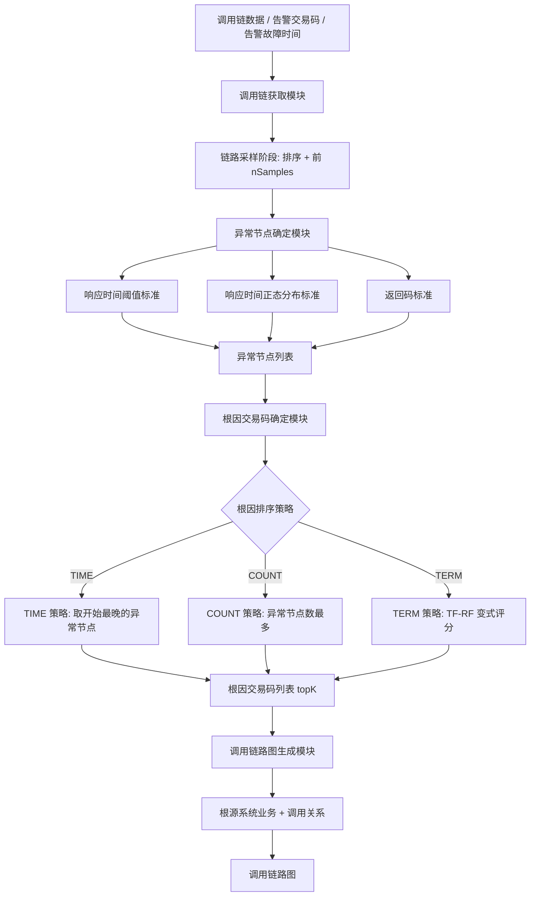
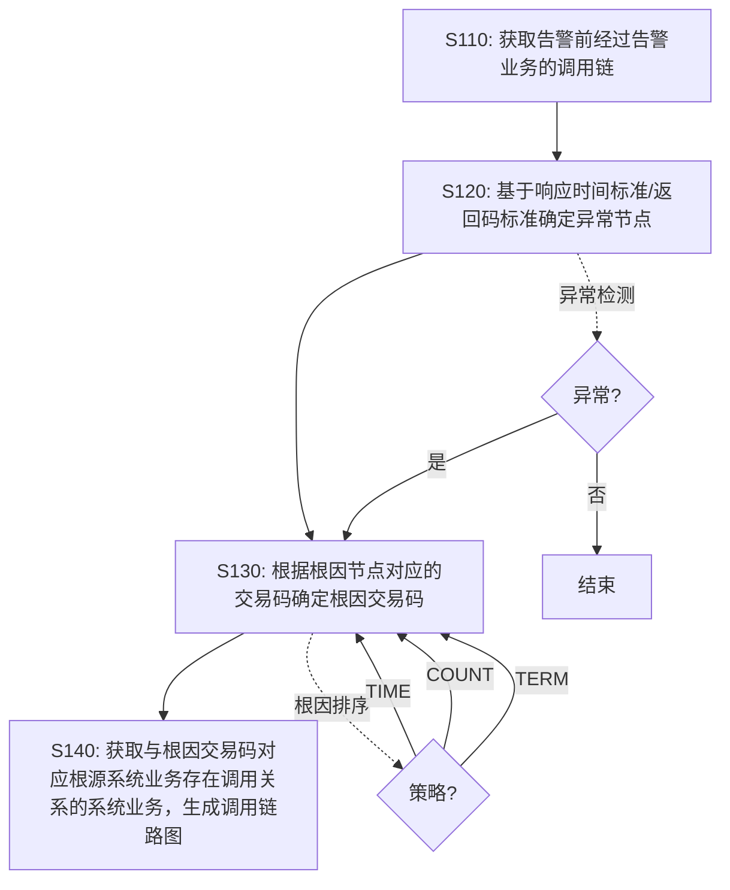

# 一种基于调用链的根因定位方法、装置、设备及存储介质（CN116820826A）

> 申请人：北京必示科技有限公司
> 申请日：2023-08-28
> 公开/授权日：2023-09-29（公开日）
> IPC分类号：G06F 11/07 (2006.01)
> 发明人：邵敏依、聂晓辉、汤汝鸣、温希道、程世文、孙永谦
> 关联文档：[同目录 CN116820826A.pdf](../../../CN116820826A.pdf)

## 一、文档信息速览

| 字段 | 值 |
|---|---|
| 专利号 | CN116820826A |
| 类型 | 发明专利申请（A） |
| 申请号 | 202311083879.6 |
| 申请日 | 2023-08-28 |
| 公开号 | CN116820826A |
| 公开/授权日 | 2023-09-29（公开日） |
| 申请人 | 北京必示科技有限公司 |
| 发明人 | 邵敏依、聂晓辉、汤汝鸣、温希道、程世文、孙永谦 |
| IPC | G06F 11/07 |
| 法律状态 | 公开，实质审查中 |

## 二、背景（Background）

本发明涉及故障处理技术领域，具体涉及一种基于调用链的根因定位方法、装置、设备及存储介质。

由于微服务架构在灵活性、可扩展性、通用性等多方面具有极大优势，越来越多的企业趋向于将微服务架构运用到系统业务上。一个用户请求需要众多服务通过调用的方式共同实现。当系统发生故障时，真正有故障的服务和与它相关的服务都会出现指标异常并发出告警。大量的告警让运维人员无法确定哪个服务才是故障根因，只能逐个服务去检查、排除掉那些本身并没有异常的服务，这不仅效率低下，而且人工成本高。

目前出现了许多聚焦于自动化的故障根因服务定位的方法，这些方法的基本思想是利用调用信息推断故障的传播。实现这类算法主要面临着三大挑战：
1. 服务之间的依赖关系非常复杂，难以分析故障在服务之间的传递；
2. 基于服务的系统往往更新迭代频率较高；
3. 系统中存在大量的服务，当服务请求高时，系统会产生海量的调用链数据，从中快速找到异常调用链信息并且定位故障十分困难。

本方案聚焦于"业务交易场景下的海量服务节点和庞大调用链数据规模"的根因定位，通过结合多种异常判断标准与多种根因排序策略，覆盖更多异常传播情况，更适合真实运维环境。

## 三、目的（Purpose / Problems Solved）

- **痛点 → 方案：异常传播路径复杂**：传统方法难以分析故障在服务间的传递。本方案通过调用链数据 + 异常节点检测 + 根因排序策略三层架构，灵活应对复杂传播。
- **痛点 → 方案：服务更新迭代快**：传统方法难以适配频繁的服务变更。本方案通过对响应时间阈值、正态分布、返回码等多种异常标准的灵活组合，提高适配性。
- **痛点 → 方案：调用链数据规模庞大**：传统方法难以处理海量调用链数据。本方案通过响应时间排序 + 前 nSamples 采样，过滤掉不重要的调用链，提升效率。
- **痛点 → 方案：单一根因排序策略不够全面**：传统方法只使用单一策略。本方案提供三种根因排序策略（TIME、COUNT、TERM），用户可根据实际需求选择。
- **痛点 → 方案：根因结果不够直观**：传统方法只输出根因交易码，不够直观。本方案通过调用链路图直观呈现根因系统业务及与其存在调用关系的系统业务。

## 四、核心原理（Principles）

### 系统总览

本方案以"调用链 + 异常检测 + 根因排序 + 调用链路图"为核心：

```
调用链获取 → 异常节点检测 → 根因排序 → 调用链路图生成
```

### 关键概念

- **调用链（Trace）**：微服务中跨多个节点的请求调用链路，由多个 span 组成。
- **响应时间标准**：包括响应时间阈值标准和响应时间正态分布标准。
- **返回码标准**：返回码 00 表示正常，其他均为异常。
- **异常节点**：不符合上述三种标准的节点。
- **根因节点**：从异常节点中通过根因排序策略确定的节点。
- **根因交易码**：根因节点对应的交易码。
- **根因排序策略**：包括 TIME、COUNT、TERM 三种策略。
- **调用链路图**：根因交易码对应的根源系统业务及与其存在调用关系的系统业务的图。

### 数学原理

#### 4.1 响应时间正态分布标准

$$
\mu_r = \frac{1}{N} \sum_{i=1}^{N} r_i, \quad \sigma_r = \sqrt{\frac{1}{N} \sum_{i=1}^{N} (r_i - \mu_r)^2}
$$

若当前响应时间超出 $[\mu_r - k \sigma_r, \mu_r + k \sigma_r]$ 范围（$k$ 默认为 3），则不符合正态分布标准。

#### 4.2 根因置信度 weight（TERM 策略）

$$
\text{weight} = \frac{\text{abnormalScore} \cdot (\text{abnormalScore} + 1)}{\text{abnormalScore} + \text{normalScore} + 1}
$$

其中：
- abnormalScore：交易码的根因节点在异常调用链的节点占比；
- normalScore：交易码的正常节点在正常调用链的节点占比；
- 该公式是 TF-RF（Term Frequency-Relevance Frequency）的变式。

### 与现有技术的差异

| 维度 | MEPFL / MicroHECL / MicroRank | 本方案 |
|---|---|---|
| 数据依赖 | 小规模实验环境 | 海量调用链数据 + 标准格式 |
| 异常判断标准 | 通常仅响应时间 | 响应时间阈值 + 正态分布 + 返回码 |
| 根因排序策略 | 单一 | TIME / COUNT / TERM 三种 |
| 调用链图 | 无 | 调用链路图直观呈现 |
| 落地能力 | 复杂 / 配置成本高 | 适配业务交易场景 |

## 五、算法详解（Algorithm）

### 输入 / 输出

- **输入**：告警业务对应的交易码、告警故障时间、调用链数据。
- **输出**：根因交易码 + 调用链路图。

### 伪代码

```python
def root_cause_localization(alert, traces):
    # Step 1: 调用链获取（链路采样阶段）
    sorted_traces = sort_traces_by_response_time(traces, descending=True)
    selected_traces = sorted_traces[:nSamples]  # 采样

    # Step 2: 异常节点检测（异常检测阶段）
    abnormal_nodes = []
    normal_traces = []
    abnormal_traces = []
    for trace in selected_traces:
        is_normal = True
        for node in trace.nodes:
            # 异常检测三标准
            if not check_threshold(node):  # 响应时间阈值
                node.abnormal = True
                is_normal = False
            if not check_normal_distribution(node):  # 响应时间正态分布
                node.abnormal = True
                is_normal = False
            if not check_ret_code(node):  # 返回码
                node.abnormal = True
                is_normal = False
        (normal_traces if is_normal else abnormal_traces).append(trace)

    # Step 3: 根因排序（根因排序阶段）
    if strategy == 'TIME':
        # TIME: 取开始时间最晚的异常节点作为根因节点
        root_cause_nodes = sorted([n for n in abnormal_nodes],
                                   key=lambda x: x.start_time, reverse=True)
    elif strategy == 'COUNT':
        # COUNT: 异常节点数量最多的交易码是根因交易码
        root_cause_codes = sorted(group_by_code(abnormal_nodes),
                                   key=lambda x: -x.count)
    elif strategy == 'TERM':
        # TERM: 综合正常分数和异常分数
        if len(normal_traces) > 0:
            root_cause_codes = compute_term_scores(abnormal_traces, normal_traces)
        else:
            # 没有正常调用链，回退到 COUNT 策略
            root_cause_codes = sorted(group_by_code(abnormal_nodes),
                                       key=lambda x: -x.count)

    # Step 4: 调用链路图生成
    for code in root_cause_codes[:topK]:
        graph = build_call_graph(code)
        yield (code, graph)
```

### 关键数学

- 响应时间正态分布：用于异常节点检测；
- 根因置信度 weight（TERM）：TF-RF 变式，用于综合评分。

### 复杂度分析

- 链路采样：$O(T \log T)$，$T$ 为调用链数；
- 异常检测：$O(T \cdot n)$，$n$ 为平均节点数；
- 根因排序（TERM）：$O(m \cdot k)$，$m$ 为异常调用链数，$k$ 为节点数；
- 调用链路图生成：$O(g)$，$g$ 为图节点/边数。

### 示例

某支付系统出现"支付接口超时"告警，告警业务为 pay_service，告警交易码为 TX_PAY，告警时间为 14:30:00：

1. **调用链获取**：在 14:20:00-14:30:00 窗口内，找出经过 pay_service 的所有调用链（trace）。按响应时间从长到短排序，取前 nSamples=100 条。
2. **异常节点检测**：
   - 遍历 100 条调用链，对每个节点检查三种异常标准：
     - 响应时间阈值：是否超过阈值（如 500ms）；
     - 响应时间正态分布：是否超出 $[\mu - 3\sigma, \mu + 3\sigma]$；
     - 返回码：是否为 00。
   - 标记所有异常节点；按是否包含异常节点将调用链分为正常调用链与异常调用链。
3. **根因排序（选择 TERM 策略）**：
   - 计算每个交易码的 abnormalScore（异常调用链中根因节点占比）和 normalScore（正常调用链中正常节点占比）。
   - 计算 weight；按 weight 从大到小排序，取 topK=3。
4. **调用链路图生成**：
   - 为 topK 交易码分别生成调用链路图，展示根源系统业务（如 order_service）和与之存在调用关系的系统业务（如 account_service、inventory_service、payment_gateway 等）。

## 六、系统架构图（Architecture）



## 七、流程图（Process Flow）



## 八、关键创新点（Key Innovations）

- **+ 三标准异常检测**：响应时间阈值标准 + 响应时间正态分布标准 + 返回码标准，三标准全符合才算正常节点，提高异常检测准确性。
- **+ 三策略根因排序**：TIME / COUNT / TERM 三种根因排序策略，根据实际场景灵活选择。
- **+ 链路采样阶段**：通过响应时间排序 + 前 nSamples 采样，过滤掉不重要的调用链，提升效率。
- **+ TF-RF 变式根因置信度**：借鉴文本分类的 TF-RF 思想，综合正常分数与异常分数计算根因置信度。
- **+ 调用链路图直观呈现**：通过调用链路图直观展示根源系统业务及与其存在调用关系的系统业务，提高根因定位的可解释性。

## 九、权利要求摘要（Claims Summary）

- **独立权利要求 1（方法）**：
  1. 获取告警前经过告警业务的调用链；
  2. 基于响应时间标准和/或返回码标准确定异常节点；
  3. 根据根因排序策略确定根因交易码；
  4. 获取与根因交易码对应根源系统业务存在调用关系的系统业务，生成调用链路图。

- **独立权利要求 9（装置）**：调用链获取模块、异常节点确定模块、根因交易码确定模块、调用链路图生成模块。
- **独立权利要求 10（电子设备）** / **独立权利要求 11（存储介质）**：标准硬件与介质权利要求。

- **从属权利要求 2-8**：
  - 响应时间排序 + 过滤；
  - 响应时间阈值标准 + 正态分布标准；
  - 返回码标准；
  - 根因排序策略（TIME/COUNT/TERM）；
  - 根因置信度计算公式。

## 十、应用场景（Use Cases）

- **金融交易系统根因定位**：对支付、清算、账户等业务系统的告警做根因定位，输出调用链路图。
- **云原生微服务故障定位**：在 Kubernetes 集群中，对服务间调用链做根因定位。
- **电商订单系统异常定位**：对订单、库存、支付、物流等服务调用做根因定位。
- **电信运营商业务系统根因定位**：对 BSS/OSS 系统调用做根因定位。
- **互联网 API 网关异常定位**：对 API 网关的下游服务调用做根因定位。

## 十一、相关专利（Related Patents in this set）

- CN114785666B（一种网络故障排查方法与系统）
- CN114818643A（保留特定业务信息的日志模板提取方法）
- CN115062144B（基于知识库和集成学习的日志异常检测方法与系统）
- CN115391160B（异常变更检测方法、装置、设备及存储介质）
- CN115392403A（异常变更检测方法、装置、设备及存储介质）
- CN116302762A（基于红蓝对抗的故障定位应用的评测方法与系统）

## 十二、术语表（Glossary）

- **调用链（Trace）**：跨多个节点的请求调用链路，由多个 span 组成。
- **span**：调用链中的单个节点，代表一个服务调用。
- **trace_id**：调用链的唯一标识。
- **span_id**：调用链中单个 span 的唯一标识。
- **parent_id**：父 span 的标识。
- **MEPFL**：Microservice Error Prediction and Fault Localization。
- **MicroHECL**：基于服务依赖关系图游走的微服务根因定位算法。
- **MicroRank**：基于扩展频谱分析的延迟根因定位算法。
- **TF-RF**：Term Frequency-Relevance Frequency，文本分类中的特征权重计算方法。
- **TOP-K**：选取前 K 个候选根因。

## 十三、参考与延伸阅读

- MEPFL: Microservice Error Prediction and Fault Localization, 相关论文。
- MicroHECL: 相关论文。
- MicroRank: 相关论文。
- 必示科技 AIOps 根因定位产品文档。
- 相关论文：基于调用链的根因定位、Trace 数据分析、TF-RF 文本分类。